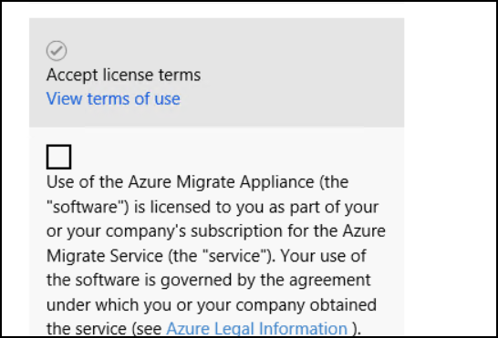

# Configure Appliance

In the previous steps you set up the Azure side of the Migrate solution and ended at the point you would download and install the on-prem components.  In this exercise you will configure the on-prem appliance and kick off a discovery to assess in Azure.

### Tips:

  * We downloaded and pre-staged the Azure Migrate appliance in advance to save time.  You will pick up with the appliance already running in Hyper-V ready for configuration.
  * To paste values in the VM console in Hyper-V, after you copy something to the clipboard click **Clipboard** from the console menu and select **Type clipboard text**.

### Configure Appliance

1. Minimize the browser and bring up the **Hyper-V Manager** Console.
2. Select the **JUMPHOST** and Double-click  the **migratenext** Virtual Machine.

	>If the VM is turned off, click the **Start** icon on the top left corner to restart the machine
	
	>If the VM is locked, click the **Keyboard keys** icon in the top left or **Action** and **Ctrl+Alt+Del** and sign in with the following password: **LetsMigrate2019!**

3. Once the system console loads it will automatically launch  the **Azure Migrate WebPortal**.

	>If the Migrate page does not load automatically you can launch it from the desktop.

4. Accept license terms by clicking the check box available under **Accept license terms** section and Click on **Continue**.
	
	

	>If the page gets stuck on installing updates, simply close and reopen the <strong>Azure Migrate Web Portal</strong> shortcut on Desktop.
	
	>If it prompts for Windows Credentials, provide Username :"**Administrator**" ,Password : "**LetsMigrate2019!**"   
	 
5. Now, Click on **Login** and then sign in to Azure using the credentials from **Environment Details** tab on the right.
	
   Then, close the "**Browser Tab**" only and go back to the other tab	 
    
6. Once logged in, **click** on the **Subscription** dropdown.
7. Select your subscription from the list.
8. Select your **Migrate project** from the dropdown.
10. **Enter Appliance Name:** **mig**
11. Click on **Register**.
12. After **Successfully registered**, click on **Continue**.
13. Then in the Provide Hyper-V Hosts details section, for the Hyper-V host credentials enter the following:

	* **User name:** localhost\contosoadmin
	* **Password:** Password.1!!
	* **Friendly Name:** HyperVAdmin

    >To paste values in the VM console in Hyper-V, after you copy something to the clipboard click **Clipboard** from the console menu and select **Type clipboard text**.
    
14. Click on **Save details**.
15. Under *Specify the list of Hyper-v hosts* **click** on **Add**.
16. Copy the value of **HyperVHostIP** from environment details page and **click** on **Validate**.
17. Then, **click** on **Save and start discovery**.

	>If you get an error while trying to initiate discovery, please go to Azure Signed In tab and login again.
	>You might see this error if your azure session logged in earlier gets expired.
	
	>When you complete the setup for the first time it will take a few minutes to discover all your VMs and begin pushing data up to the portal.  Once the appliance configuration completes you will be able to see the state of services and return to the portal to begin viewing assessment data.
