# Building a Chat Bot with the Azure Bot Service

Software bots are everywhere. You probably interact with them every day without
realizing it. Bots, especially chat and messenger bots, are changing the way we interact
with businesses, communities, and even each other. Thanks to light-speed advances in
artificial intelligence (AI) and the ready availability of AI services, bots are not only
becoming more advanced and personalized, but also more accessible to developers.

Regardless of the target language or platform, developers building bots face a variety of
challenges. Bots must be able process input and output intelligently. Bots need to be
responsive, scalable, and extensible. They need to work cross-platform, and they need to
interact with users in a conversational manner and in the language that the user
chooses.

[The Azure Bot Service](https://azure.microsoft.com/en-us/services/bot-service/), combined with [Microsoft QnA Maker](https://www.qnamaker.ai/), provide the tools
developers need to build and publish intelligent bots that interact naturally with users
using a range of services. In this lab, you will create a bot using the Azure Bot Service
and connect it to a knowledge base built with QnA Maker. Then you will interact with
the bot using Skype — one of many popular services with which bots built with the
Azure Bot Service can integrate.

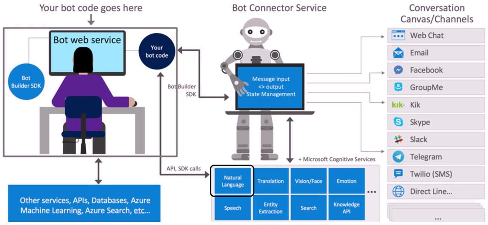

## Objectives

In this hands-on lab, you will learn how to:
                  
• Create a QnA Maker knowledge base

• Publish a QnA Maker knowledge base

• Integrate a knowledge base with Azure Bot Service

• Chat with the bot to verify the code is working

• Add Chit-chat personality at your knowledge base

## Prerequisites

The following are required to complete this hands-on lab:

• Azure Pass or subscription - [Try it for Free](https://azure.microsoft.com/en-gb/)

# Case description

A bot is an autonomous program that interacts with people or computer systems in a
predictable way. The logic behind a bot is designed and programmed by the bot
creator, often with the help of tools like the Microsoft Bot Framework. Microsoft also has
other AI services, included in Azure Cognitive Services, that can enhance the capabilities
of your bots.

QnA Maker is one of the AI services that can help a bot answer your users' natural
language questions by matching them with the best possible answers from your
knowledge base.

# What is the QnA Maker

QnA Maker is a cloud-based Natural Language Processing (NLP) service that easily
creates a natural conversational layer over your data. It can be used to find the most
appropriate answer for any given natural language input, from your custom knowledge
base (KB) of information.

A client application for QnA Maker is any conversational application that communicates
with a user in natural language to answer a question. Examples of client applications
include social media apps, chat bots, and speech-enabled desktop applications.

# Exercise 1: Create a knowledge base from QnA Maker Portal

## Create a knowledge base

1. Sign in to the [QnA Maker](https://www.qnamaker.ai/) portal.

2. Select **Create a knowledge base** from the top menu.

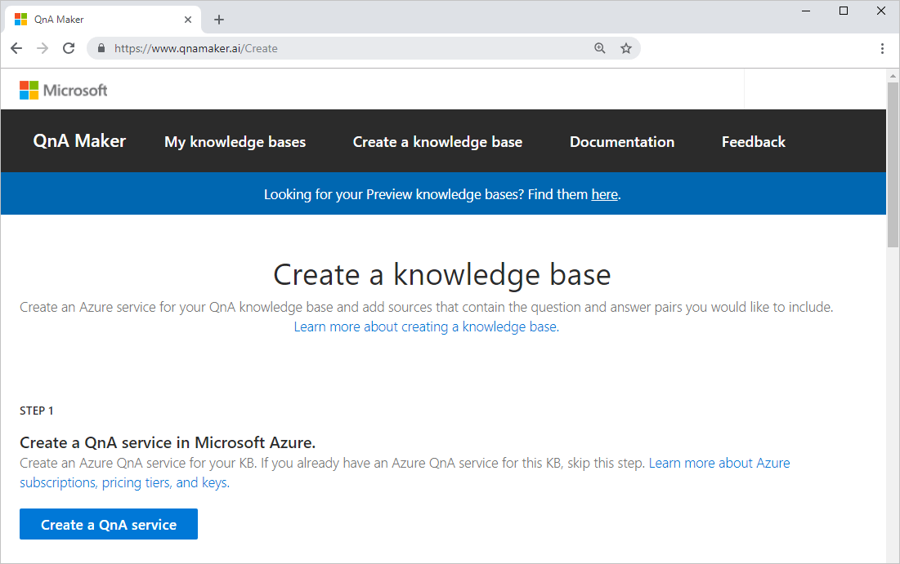

3. Select Create a QnA service. You will be redirect on Azure Portal.

4. Provide the required information:

    1. **Name:** chatbot-qna2. Subscription: Select your existing subscription
    
    2. **Subscription:** Select your existing subscription
    
    3. **Pricing tier:** Select F0 (3 Calls per second)
    
    4. **Resource group:** Clic on Create new and type the name qna-lab-rg
    
    5. **Resource group location:** Select Central US (or nearest region)
    
    6. **Search pricing tier:** Select F (3 Indexes)
    
    7. **Search Location:** Select Central US (or nearest region)
    
    8. **App name:** chatbot-qna9. Website Location: Select Central US (or nearest region)
    
    10. **Application Insights Location:** Select Central US (or nearest region)
    
    5.  
    
    6. Click Create to deploy the service. This step might take a few moments.
    
    7. Once the deployment is complete, return to QnA Maker portal and click Refresh
       on step 2.
     
    8. Select your existing settings:
    
  ##  **Setting : Purpose**
  
  **Microsoft Azure Directory ID** : This ID is associated with the account you use to sign into the Azure portal and the QnA Maker portal.

  **Azure Subscription name** : The billing account in which you created the QnA Maker resource.

  **Azure QnA Service** :  Your existing QnA Maker resource.
  
  
  9. 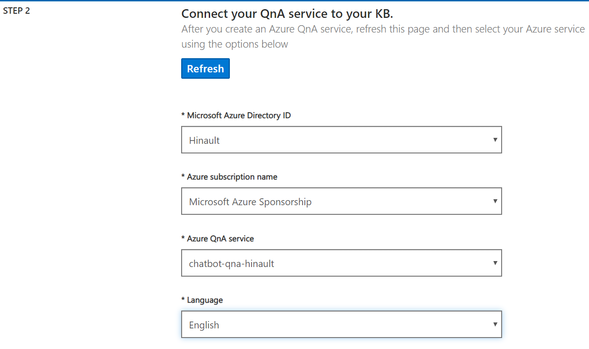
  
  10. Enter your knowledge base name, AI Bootcamp kb.
  
  
  
 
 Populate your knowledge base with the following settings:

 11. 
  ## **Setting : name : Setting value Purpose**
 
 **-** **URL** **:** https://docs.microsoft.com/en-us/azure/cognitive-services/QnAMaker/troubleshooting **:** The contents of the FAQ at that URL are formatted with a question followed by an answer. QnA
                                                                                            Maker can interpret this format to extract questions and the associated answers.
                                                                                            
  
 **-** **File** **:** *not used in this tutorial* **:** This uploads files for questions and answers.
 
 **-** **Chit-chat personality** **:** None **:** This gives a friendly and casual [personality](https://github.com/hinault/Workshop-ChatBot-With-QnAMaker/blob/master/Concepts/best-practices.md#chit-chat) to common questions and answers. You can edit these questions and answers later.
  
  
  12. 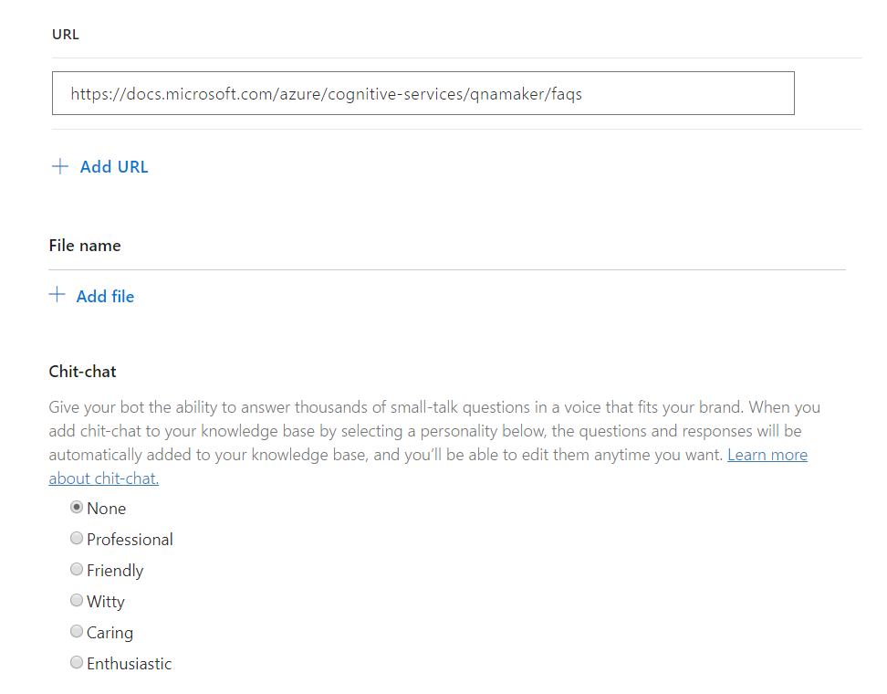
  
  13. Select **Create your KB** to finish the creation process.
  
  14. 
  
  ## Review, save, and train the knowledge base
  
  1. Review the questions and answers.
  
  2. 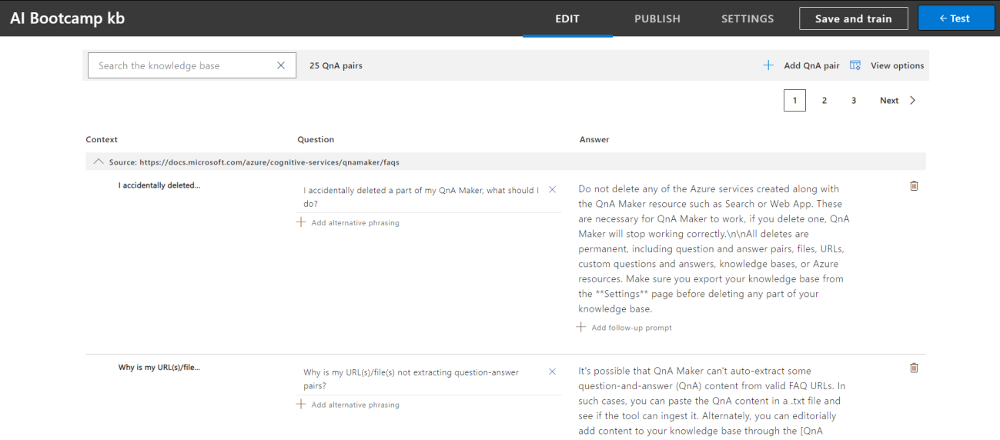
  
  3. Select **Test** in the top menu bar.
  
  4. Type **how large** on the text box.
  
  5. Select Inspect. You can add alternative phrasing for this Answer or new answer
     for this question, if you think the answer is wrong
     
  6. 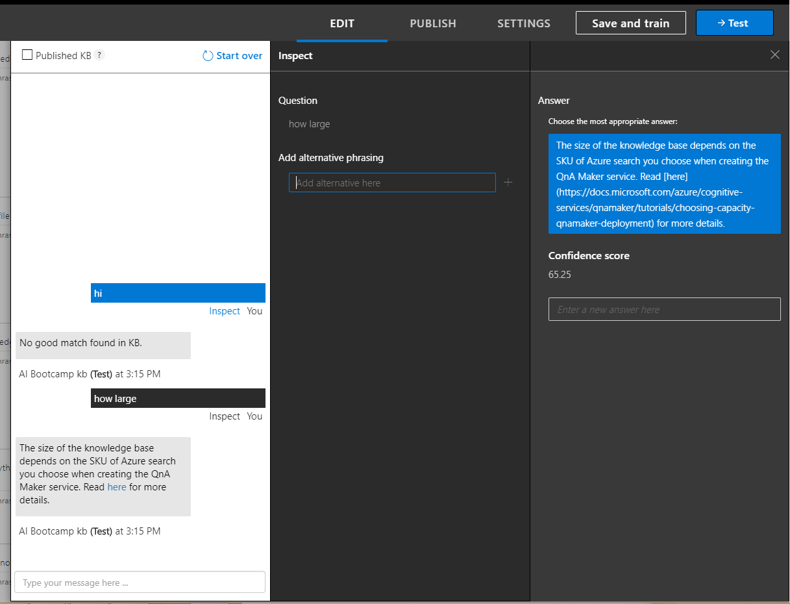
  
  7. Select **Save and train** in the top menu bar.
  
  ## Publish to get knowledge base endpoints
  
  Select the **Publish** button from the top menu. On the publish page, select **Publish**.
  
  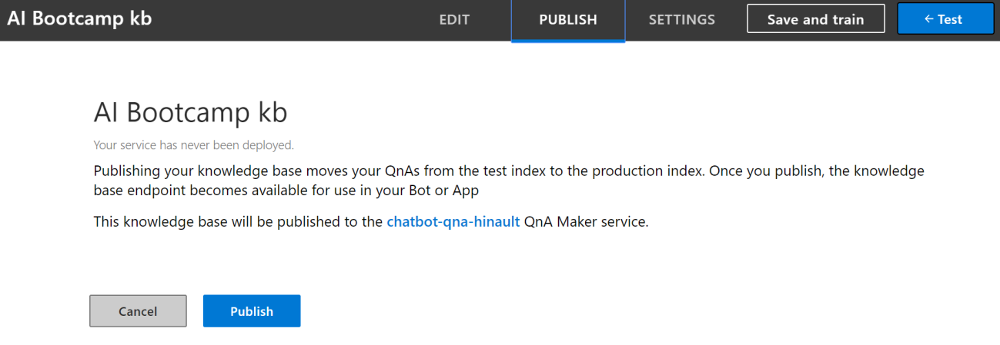
  
  After the knowledge base is published, the endpoint is displayed.
  
  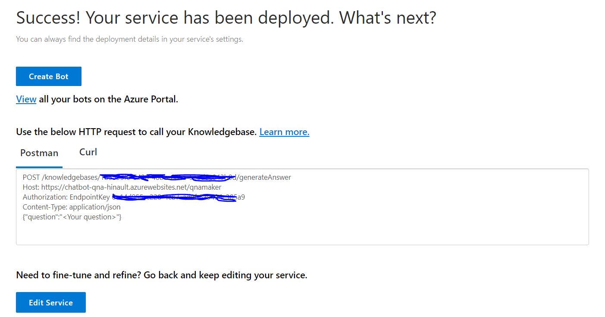
  
  Don't close this **Publish** page. You need it later in the tutorial, to create a bot.
  
  
  
  ## Use cURL to query for an FAQ answer
  
  1. Select the **Curl** tab.
  
  
  
  1. Copy the text of the **Curl** tab, and run it in a cURL-enabled terminal or commandline. The authorization header's value includes the text Endpoint, with a trailing
space and then the key.
  
  2. Replace <Your question> with How large can my KB be?. This is close to the
question, How large a knowledge base can I create?, but not exactly the same.
QnA Maker applies natural language processing to determine that the two
questions are the same.
  
  3. Run the cURL command and receive the JSON response, including the score and
answer.

  4. 
  
  5. QnA Maker is somewhat confident with the score of 35.92%.
  
  ## Use cURL to query for the default answer
  
Any question that QnA Maker is not confident about receives the default answer. This
answer is configured in the Azure portal.
    
  1. In the cURL-enabled terminal, replace How large can my KB be? with x.
    
  2. Run the cURL command and receive the JSON response, including the score and
answer

  3. 
    
  4. QnA Maker returned a score of 0, which means no confidence. It also returned
the default answer

## Create a QnA Bot

Create a bot as a client application for the knowledge base.
    
  1. In the QnA Maker portal, go to the **Publish** page, and publish your knowledge
base. Select **Create Bot**.

1. 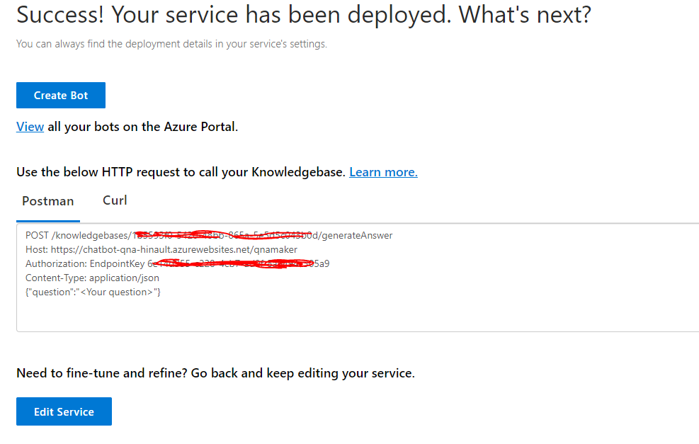

  2. The Azure portal opens with the bot creation configuration.
    
  3. Enter the settings to create the bot:
    
    
  ##  Setting : Value : Purpose
  
  **Bot name** : aibootcampqna-bot : This is the Azure resource name for the bot.
  
  **Subscription** : See purpose. : Select the same subscription as you used to create the QnA Maker resources.
  
  **Resource group** : lab-rg-bot : The resource group used for all the botrelated Azure resources.
  
  **Location** : Canada East : The bot's Azure resource location.
  
  **Pricing tier** : F0 : The free tier for the Azure bot service.
  
  
 ## Setting : Value : Purpose
 
**App name** : :aibootcampqna-bot-app: This is a web app to support your bot only. This should not be the same app name as your QnA Maker service is already using. Sharing QnA Maker's web app with any other
 resource is not supported.

**SDK Language** : C# : This is the underlying programming language used by the bot framework SDK. Your choices are [C#](https://github.com/Microsoft/botbuilder-dotnet) or [Node.js](https://github.com/Microsoft/botbuilder-js).

**QnA Auth Key** : **Do not change** : This value is filled in for you.

**App service plan/Location** : **Do not change** : For this tutorial, the location is not important.

**Azure Storage** : **Do not change** : Conversation data is stored in Azure Storage tables.

**Application Insights** : **Do not change** : Logging is sent to Application Insights.

**Microsoft App ID** : **Do not change** : Active directory user and password isrequired.

4. 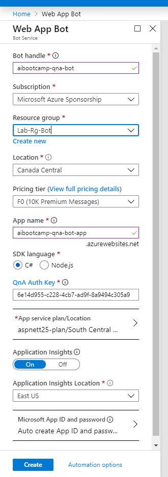

5. Wait a couple of minutes until the bot creation process notification reports
success.

## Chat with the Bot

In the Azure portal, open the new bot resource from the notification.

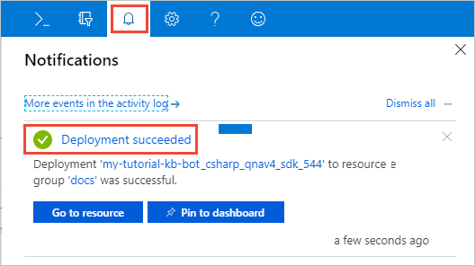

From **Bot management**, select **Test in Web Chat** and enter: How large can my KB be?.

The bot will respond with:

The size of the knowledge base depends on the SKU of Azure search you choose when

creating the QnA Maker service. Read

[here](https://docs.microsoft.com/azure/cognitiveservices/qnamaker/tutorials/choosing-capacity-qnamaker-deployment)for more details.

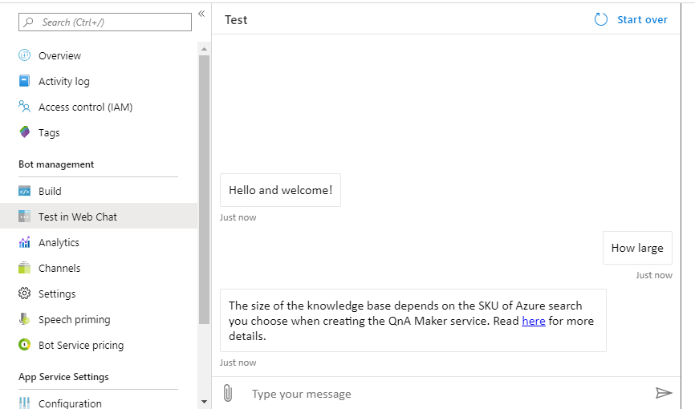

## Add personality with Chit-Chat

Adding chit-chat to your bot makes it more conversational and engaging. The chit-chat
feature in QnA maker allows you to easily add a pre-populated set of the top chit-chat,
into your knowledge base (KB). This can be a starting point for your bot's personality,
and it will save you the time and cost of writing them from scratch.

This dataset has about 100 scenarios of chit-chat in the voice of multiple personas, like
Professional, Friendly and Witty.

Some examples of the different personalities are below. You can see all the
personality [datasets](https://github.com/Microsoft/BotBuilder-PersonalityChat/tree/master/CSharp/Datasets) along with details of the personalities.

For the user query of When is your birthday?, each personality has a styled response:

## Personality : Example

**Professional** : Age doesn't really apply to me.

**Friendly** : I don't really have an age.
 
**Witty** : I'm age-free.

**Caring** : I don't have an age.

**Enthusiastic** : I'm a bot, so I don't have an age.

## Add Chit-Chat in your KB

1. Download the English friendly [datasets on GitHub](https://github.com/Microsoft/BotBuilder-PersonalityChat/tree/master/CSharp/Datasets)

2. Go to qnamaker.ai portal. Select your KB and select **Settings** from the top menu.

3. Scroll down to **Manage knowledge base**

4. On **File name** sub section, click on **Add file** and add qna_chitchat_friendly.tsv file.

1. Click **Save and Train** from top menu.

2. Click on **Edit** for review the questions and answers.

3. Select the last page of questions and answers from the bottom of the table. The
page shows questions and answers from the Chit-chat personality.

4. From the toolbar above the list of questions and answers, select the View options
icon, and then select Show metadata. This shows the metadata tags for each
question and answer. The Chit-chat questions have the editorial: chit-chat
metadata already set. This metadata is returned to the client application, along
with the selected answer. The client application, such as a chat bot, can use this
filtered metadata to determine additional processing or interactions with the
user.

 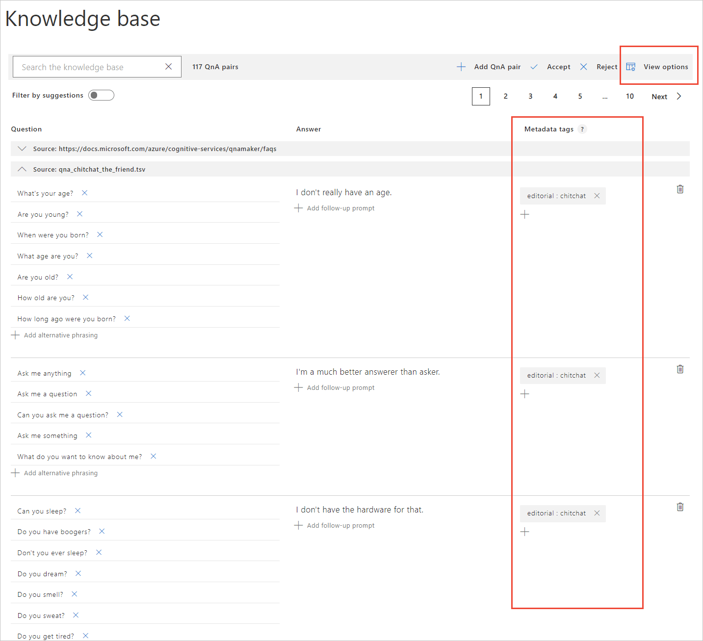

1. Select the **Publish** button from the top menu. On the publish page,
select **Publish**.

### *Use cURL to query for a Chit-chat answer*

1. In the cURL-enabled terminal, replace How large can my KB be? with a bot
conversation-ending statement from the user, such as Thank you.

2. Run the cURL command and receive the JSON response, including the score and
answer.

3. % Total % Received % Xferd Average Speed Time Time Time Current

4. Dload Upload Total Spent Left Speed

5. 100 525 100 501 100 24 525 25 --:--:-- --:--:-- --:--:-- 550{

6. "answers": [

7. {

8. "questions": [

9. "Thank you",

10. "Thanks",

11. "Thnx",

12. "Kthx",

13. "I appreciate it",

14. "Thank you so much",

15. "I thank you",

16. "My sincere thank"

17. ],

18. "answer": "You're very welcome.",

19. "score": 100.0,

20. "id": 109,

21. "source": "qna_chitchat_the_friend.tsv",

22. "metadata": [

23. {

24. "name": "editorial",

25. "value": "chitchat"

26. }

27. ]

28. }

29. ]

30. }

31.

Because the question of Thank you exactly matched a Chit-chat question, QnA
Maker is completely confident with the score of 100. QnA Maker also returned all
the related questions, as well as the metadata property containing the Chit-chat
metadata tag information.

## *Chat with the bot*

Go back in **Test in Web Chat** on Azure Portal and chat with your bot.

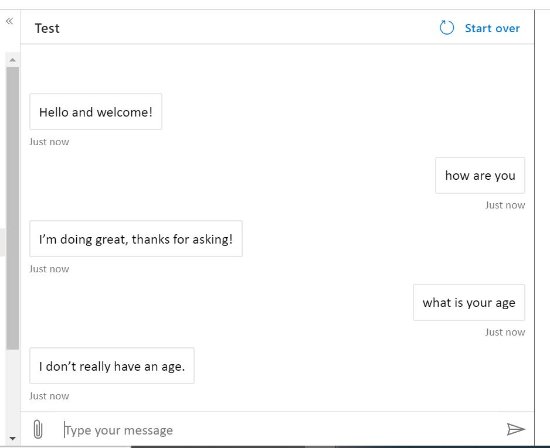

# Clean up resources

Finally, If you don't expect to need these resources in the future, you can delete them by
deleting the resource group. To do so, select the resource group for this workshop,
select Delete, then confirm the name of the resource group to delete.

  
  
     
     
  
  

