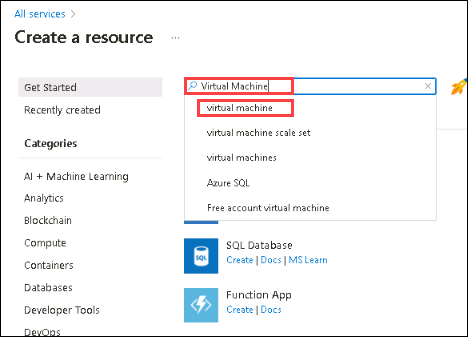
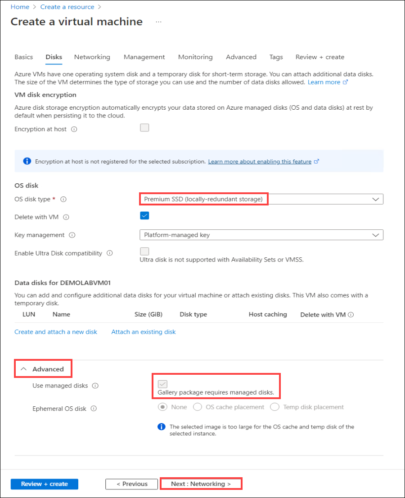
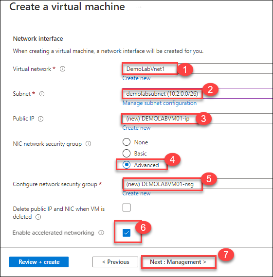
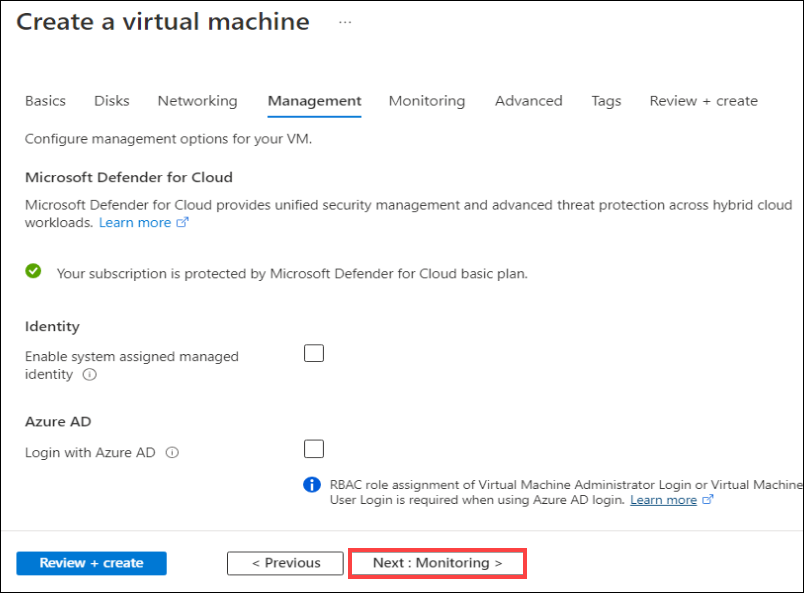
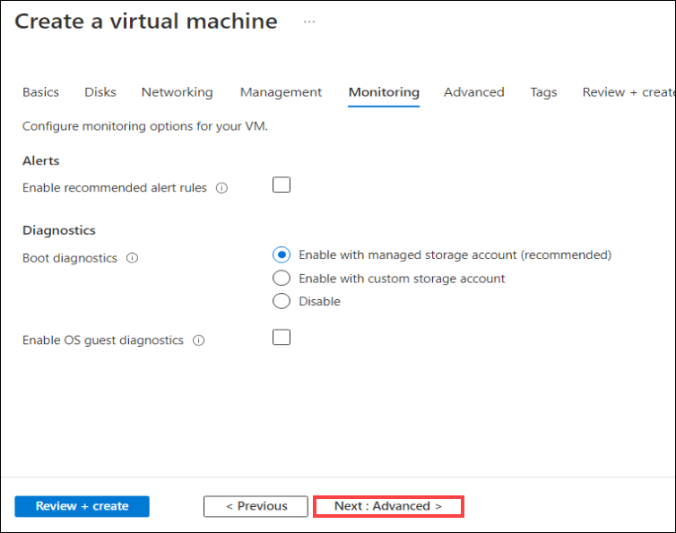

## **Scenario 3 - Deploy a Virtual Machine**
In this part of the lab, we will deploy an **Azure Virtual Machine** using the foundational elements we created in the first two scenarios of this lab.

 1. Click on the   menu icon at the upper left corner of the Azure portal.

 2. Click on **+ Create a resource**.

     
     
 3. On the search box, type **Virtual Machines** and select to open it.

     
     
 4. On the **Create a virtual machine** blade, on the **Basics** tab, enter the following information:
  
     - Subscription: Select your **subscription (1)**.
 
     - Resource group: Select the existing resource group named **azvmrg-<inject key="Deployment ID" enableCopy="false"/> (2)**
    
     - Virtual machine name: **DEMOLABVM01 (3)**
         > **Note:** If you see any validation error, please adjust the name.
     
     - Region:  Select the region you are using to perform the lab **(4)**.
 
     - Choose **Availabilty set (5)** from the **Availability options** dropdown menu.

     - Select the availability set **demolabavaset1 (6)** that you created in the previous scenario from the **Availability set** drop down menu.

     - Image: **Windows Server 2019 Datacenter - x64 Gen1 (7)**

     - On the **Size** field, Select **D4S_v3 Standard (8)** from the frop-down list. ( Incase if you don't find the given size of VM from drop-down list, click on **Change size** later on the **Select a VM size** blade, click on **Clear all filters** and scroll down to select **D4S_v3 Standard** and then click on  Select).

         

     - Username: **demouser (9)**

     - Password: **Password.1!! (10)**

     - Confrim Password: **Password.1!! (11)**

     - Public inbound ports: Select **Allow selected ports (12)**

     - Select inbound ports : Select **RDP (3389) (13)** from drop-down list

     - Already have a Windows license?: **No (14)**

         > **Note:** If you own Windows Server licenses with active Software Assurance (SA), use Azure Hybrid Benefit to save money. [Learn More](https://azure.microsoft.com/en-us/pricing/hybrid-use-benefit/#services)
  
     - Click on **Next:Disks>**
  
       
      

 #### **Disks**
When an Azure virtual machine is created, two disks are automatically attached to the virtual machine.
An operating system disk hosts the VMs operating system and a temporary disk used for operations such as temporary data processing. Later in the lab, you will add and additional data disk for installing applications and storing data. 

5. On the **Disks** tab, set the following configuration:

   - OS disk type: **Premium SSD**

   - Click on **ADVANCED** and you can see that **Use managed disks** is checked by default.

     > **Note:** Azure Managed Disks simplifies disk management for Azure IaaS VMs by managing the storage accounts associated with the VM disks. For best performance, reliability, scalability and access control we recommend Azure Managed Disks for most virtual machine configurations. You only have to specify the type (Premium or Standard) and the size of disk you need, and Azure creates and manages the disk for you. [Learn more](https://docs.microsoft.com/en-us/azure/storage/storage-managed-disks-overview)
 
    -  Click on **Next:Networking>** 

       
       
6. On the **Networking tab** tab, set the following configurations:

    - Select the **DemoLabVnet1 (1)** virtual network from the **Virtual network** dropdown menu.

    - Verify that **demolabsubnet (2)** is selected in the **Subnet** field

    - Verify that the **Public IP (3)** address field has a status that begins with **(new)**

       > **Note:** Use a public IP address if you want to communicate with the virtual machine from outside the virtual network. For example, if you will need to RDP to the VM, you will need a public IP address. 

   - In the **NIC network security group (4)** field, select **Advanced** 

   - In the **Configure network security group (5)**, verify **(new)DEMOLABVM01-nsg** is selected

       > **Note:** A **Network Security Group** is a set of firewall rules that control traffic to and from your virtual machine. [Learn more.](https://docs.microsoft.com/en-us/azure/virtual-network/virtual-networks-nsg)

   -  Verify that **Enable accelerated networking (6)** is **on**.

       > **Note:** Accelerated networking Enables low latency and high throughput on the network interface.
    
   - Leave the default option set for Load balancing.

   - Click on **Next : Management > (7)** 

       
       
7. On the **Management** tab, leave all to default and click on **Next: Monitoring**.

      

8. On the **Monitoring** tab:

     - Leave the default options selected for **Boot diagnostics** and **Enable OS guest diagnostics** under the **MONITORING** section

        > **Note:** Azure Monitor enables you to consume telemetry to gain visibility into the performance and health of your workloads on Azure. The most important type of Azure telemetry data is the metrics (also called performance counters) emitted by most Azure resources. [Learn more.](https://docs.microsoft.com/en-us/azure/monitoring-and-diagnostics/monitoring-overview-metrics)

    - Click on **Next : Advanced >** to navigate to the **Advanced** tab

   
   
#### **Advanced configuration**

8. In the **Extensions** pane, you could customize your virtual machine through the addition of extensions. You will not add an extension during this scenario.

9. Now click on **Next : Tags >** to go to the **Tags** tab

  

#### **Tags**

Tags are name/value pairs that enable you to categorize resources and view consolidated billing by applying the same tag to multiple resources and resource groups

   > **Note:**  After you apply tags, you can retrieve all the resources in your subscription with that tag name and value. Tags enable you to retrieve related resources from different resource groups. This approach is helpful when you need to organize resources for billing or management.[Learn more.](https://docs.microsoft.com/en-us/azure/azure-resource-manager/resource-group-using-tags)
    
   > **Note:** In this scenario we are not creating any tags for categorizing resources.

10. Click on **Next : Review + create >** to review the settings and **Create a virtual machine** blade will be displayed with a **Validation passed** message at the top of the blade

    

11. Click **Create** to deploy the virtual machine.

    > **Note:** Deployment of the virtual machine can take up to 10 minutes. You can check the status of the virtual machine deployment by clicking on the notification (Bell) icon at the top of the page. While you can wait for the deployment to succeed before continuing to the next scenario, you can continue with subsequent steps while the deployment completes. 

This completes this scenario. Click **Next** to go to the next scenario.
