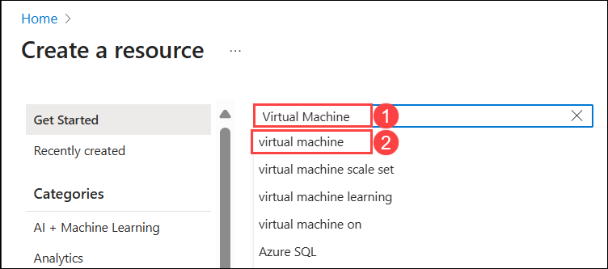
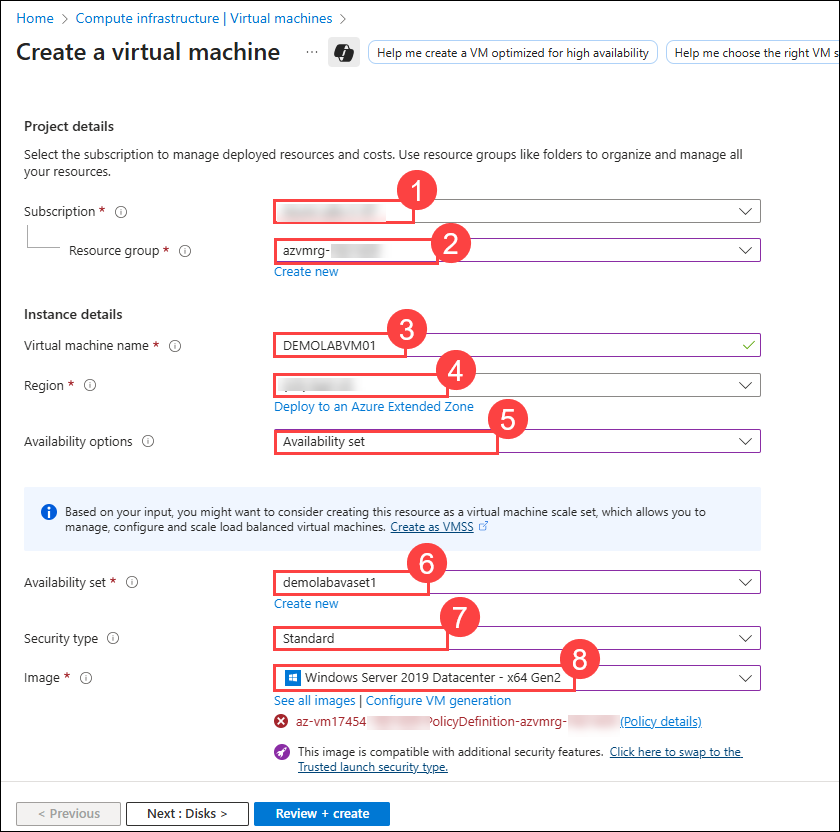
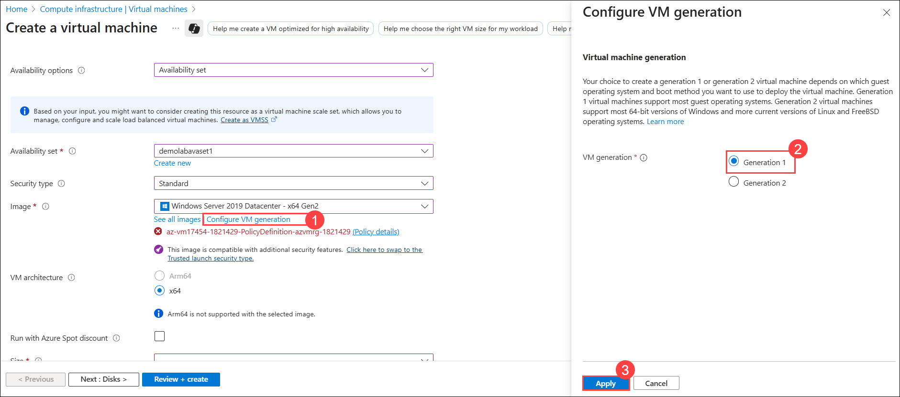
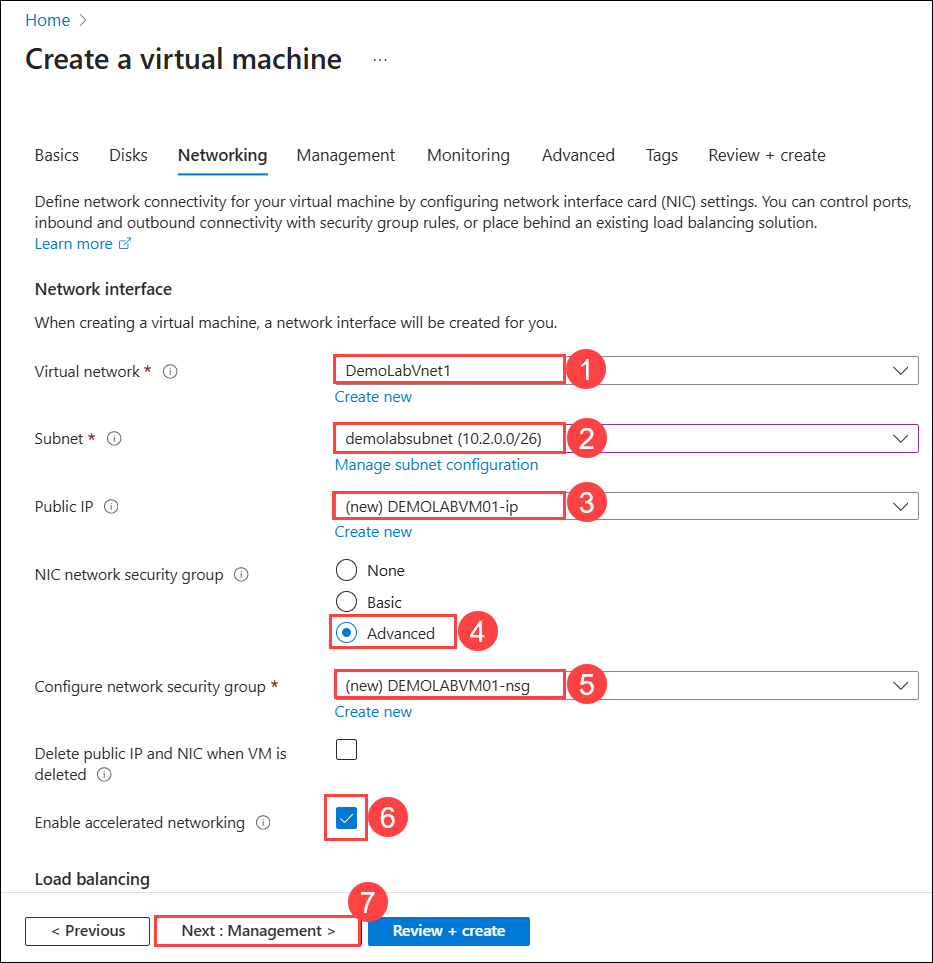
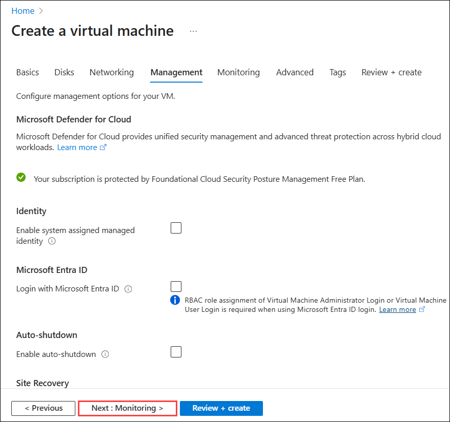
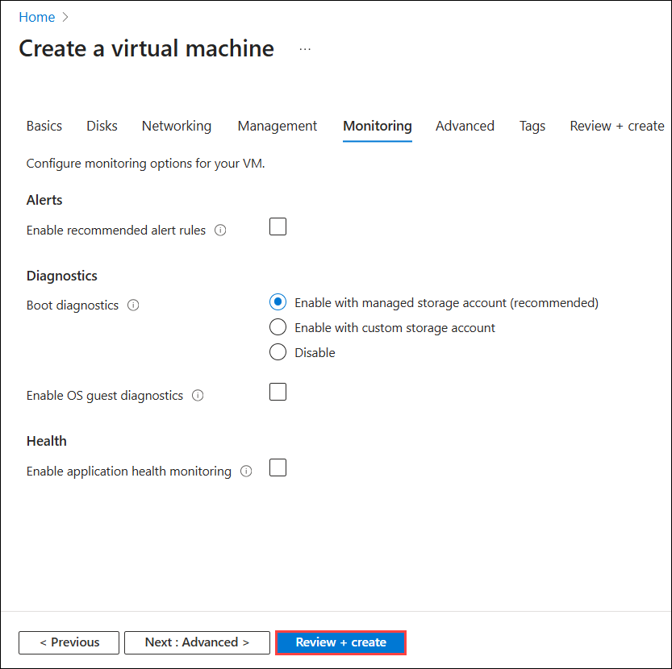
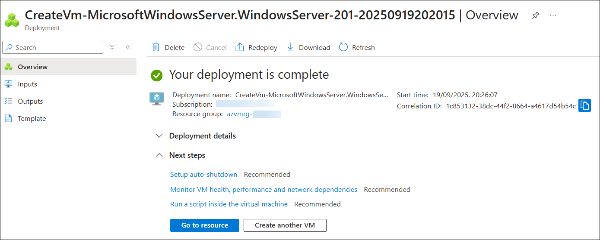

# Lab 03 - Deploy a Virtual Machine

### Estimated Duration: 40 Minutes

## Overview

You are a Cloud Administrator for Contoso Ltd., tasked with deploying a Windows-based virtual machine in Azure to host a critical business application. Using the virtual network and availability set you created in the previous labs, you will configure and launch a VM with specific compute, storage, and networking settings. In this lab, you will select the appropriate image, size, and security options, attach it to the correct subnet, and ensure it is accessible via Remote Desktop Protocol (RDP). This deployment will provide a reliable, scalable, and secure environment for running enterprise workloads.
 
In this part of the lab, we will deploy an **Azure Virtual Machine** using the foundational elements we created in the first two scenarios of this lab.

## Lab objective

You will be able to complete the following task:

- Task 1: Deploy a Virtual Machine

## Task 1: Deploy a Virtual Machine

In this task, you will deploy a Windows Server virtual machine into the previously created availability set. This ensures the VM benefits from fault and update domain distribution, improving uptime and resilience for your workloads.

1. Click on the **Hamburger menu (1)** at the upper left corner of the Azure portal and click on **+ Create a resource (2)**.

    
     
1. In the search box, type **Virtual Machine (1)** and select  **virtual machine (2)** to open it.

      

1. Select **Create (1)** drop-down and then choose **Virtual Machine (2)** from the options.

      
   
1. On the **Create a virtual machine** blade, on the **Basics** tab, enter the following information:
  
    - Subscription: **Accept default subscription (1)**.
 
    - Resource group: Select the existing resource group named **azvmrg-<inject key="Deployment ID" enableCopy="false"/> (2)**
    
    - Virtual machine name: **DEMOLABVM01 (3)**

        > **Note:** If you see any validation error, please adjust the name.
     
    - Region: Select **<inject key="Region" enableCopy="false"/>** **(4)**.
 
    - Choose **Availabilty set (5)** from the **Availability options** dropdown menu.

    - Select the availability set **demolabavaset1 (6)** that you created in the previous scenario from the **Availability set** drop down menu.
     
    -  Choose **Standard (7)** from the **Security Type** dropdown menu.

    - Image: Select **Windows Server 2019 Datacenter - x64 Gen2 (8)** from the drop-down list.

       

    - Then, click on **Configure VM generation (1)**. From the Configure VM generation tab, select **Generation 1 (2)**, and select **Apply (3)** to change the image Generation to **Windows Server 2019 Datacenter - x64 Gen1** as shown in the picture.
   
      

    - On the **Size** field, Select **Standard_D4s_v3 (9)** from the drop-down list. 
          
        >**Note:** In case you don't find the given size of VM from the drop-down list, click on **Change size** later on the **Select a VM size** blade, click on **Clear all filters** and scroll down to select **Standard_D4s_v3** and then click on  **Select**.

             

    - Username: **demouser (10)**

    - Password: **Password.1!! (11)**

    - Confirm Password: **Password.1!! (12)**

    - Public inbound ports: Select **Allow selected ports (13)**.

    - Select inbound ports: Select **RDP (3389) (14)** from the drop-down list.

    - Would you like to use an existing Windows Server license? **Leave as default (15)**.

        > **Note:** If you own Windows Server licenses with active Software Assurance (SA), use Azure Hybrid Benefit to save money. [Learn More](https://azure.microsoft.com/en-us/pricing/hybrid-use-benefit/#services)
  
    - Click on **Next : Disks > (16)**.
  
       

1. On the **Disks** tab, set the following configuration:

   - OS disk Size: **Leave it default**

   - OS disk type: **Premium SSD (1)**

   - Click on **ADVANCED** and you can see that **Use managed disks (2)** is checked by default.

     > **Note:** Azure Managed Disks simplifies disk management for Azure IaaS VMs by managing the storage accounts associated with the VM disks. For best performance, reliability, scalability and access control, we recommend Azure Managed Disks for most virtual machine configurations. You only have to specify the type (Premium or Standard) and the size of disk you need, and Azure creates and manages the disk for you. [Learn more](https://docs.microsoft.com/en-us/azure/storage/storage-managed-disks-overview)
 
    -  Click on **Next : Networking > (3)**. 

       
     
1. On the **Networking** tab, set the following configurations:

    - Select the **DemoLabVnet1 (1)** virtual network from the **Virtual network** dropdown menu.

    - Verify that **demolabsubnet (2)** is selected in the **Subnet** field.

    - Verify that the **Public IP (3)** address field has a status that begins with **(new)**.

       > **Note:** Use a public IP address if you want to communicate with the virtual machine from outside the virtual network. For example, if you need to RDP to the VM, you will need a public IP address. 

   - In the **NIC network security group** field, select **Advanced (4)**. 

   - In the **Configure network security group**, verify **(new)DEMOLABVM01-nsg (5)** is selected.

       > **Note:** A **Network Security Group** is a set of firewall rules that control traffic to and from your virtual machine. [Learn more.](https://docs.microsoft.com/en-us/azure/virtual-network/virtual-networks-nsg)

   -  Verify that **Enable accelerated networking** is **ON (6)**.

       > **Note:** Accelerated networking enables low latency and high throughput on the network interface.
    
   - Leave the default option set for **Load balancing**.

   - Click on **Next : Management > (7)**. 

       
       
1. On the **Management** tab, `leave all to default` and click on **Next : Monitoring >**.

      

1. On the **Monitoring** tab, `leave the default options` and click on **Review + create.**

    > **Note:** Azure Monitor enables you to consume telemetry to gain visibility into the performance and health of your workloads on Azure. The most important type of Azure telemetry data is the metrics (also called performance counters) emitted by most Azure resources. [Learn more.](https://docs.microsoft.com/en-us/azure/monitoring-and-diagnostics/monitoring-overview-metrics)

      

1. On **Create a virtual machine** blade you will be displayed with a **Validation passed** message at the top of the blade, then click **Create** to deploy the virtual machine. 

    > **Note:** Deployment of the virtual machine can take up to 10 minutes. You can check the status of the virtual machine deployment by clicking on the notification (Bell) icon at the top of the page. While you can wait for the deployment to succeed before continuing to the next scenario, you can continue with subsequent steps while the deployment completes.

    

1. Wait for the deployment to complete.

    

>**Congratulations** on completing the Task! Now, it's time to validate it. Here are the steps:
> - Hit the Validate button for the corresponding task. If you receive a success message, you have successfully validated the lab. 
> - If not, carefully read the error message and retry the step, following the instructions in the lab guide.
> - If you need any assistance, please contact us at cloudlabs-support@spektrasystems.com.   

<validation step="9167bbff-7946-48a6-bef5-3c037f89f2e9" />

## Summary

In this lab, you have completed the following:

- Deployed a Virtual Machine.

### You have successfully completed the lab. Now, click on **Next >>** from the lower right corner to proceed on to the next lab.

