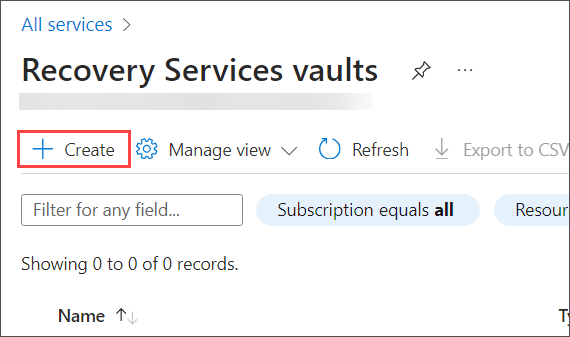
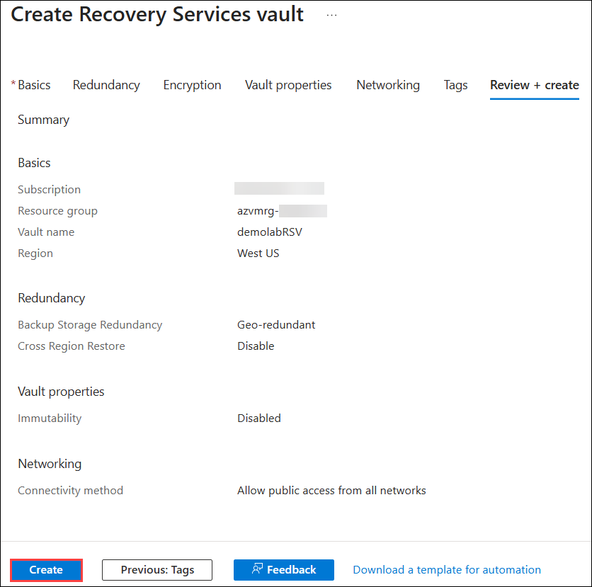
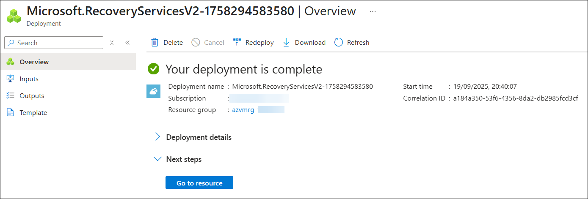
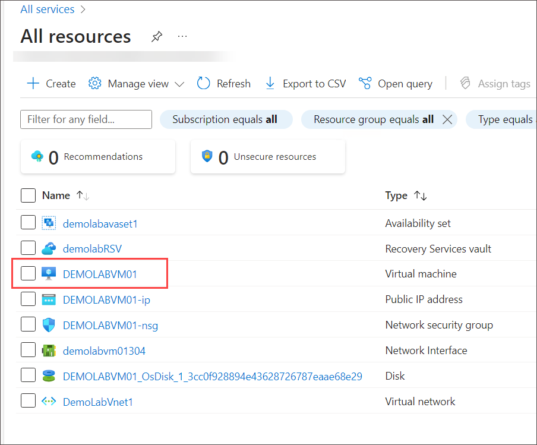
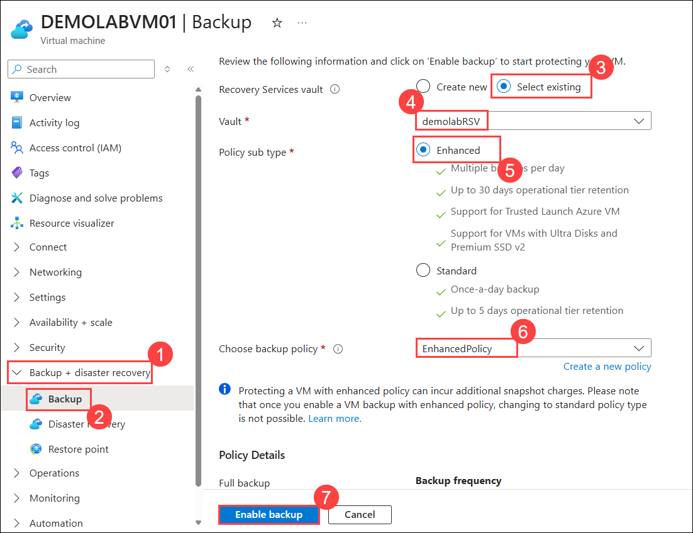

# Lab 04: Backup and Recovery

### Estimated Duration: 30 Minutes

## Overview

In this lab, you will implement Azure Backup and Recovery Services to protect a production virtual machine against data loss and outages. You will create a Recovery Services vault, configure it with an enhanced backup policy, and enable backup for the VM. This setup ensures secure, point-in-time recovery options, allowing quick restoration in case of accidental deletion, corruption, or datacenter failure. By completing this lab, you will establish a reliable backup and recovery strategy to support business continuity and disaster recovery requirements.

## Lab objectives

You will be able to complete the following tasks:

- Task 1: Create a Recovery Services vault
- Task 2: Enable Virtual Machine Backup

## Task 1: Create a Recovery Services vault

In this task, you will create a Recovery Services vault and configure backup for a virtual machine. This ensures that the VM’s data is securely stored and can be restored in case of data loss or system failure.

 1. Click on the **Hamburger menu (1)** at the upper left corner of the **Azure portal** and click on **All services (2)**.

    
 
 1. On the **All Services** blade, search for <copy> **Recovery (1)** </copy> in the seach bar and select **Recovery Services vaults (2)** from the results.

     
    
 1. On the **Recovery Services vaults** blade, click **+ Create** from the top menu bar.

    
 
 1. On the **Basics** tab of Create Recovery Services vault blade enter the following details:
 
     - **Subscription:** Keep the default **Subscription (1)**.
 
     - **Resource group:** Select the existing resource group **azvmrg-<inject key="Deployment ID" enableCopy="false"/> (2)** from the dropdown menu.
 
     - **Vault name:** Enter <copy>**demolabRSV**</copy> **(3)**.
 
     - **Region:** Select **<inject key="Region" enableCopy="false"/>** **(4)** from the dropdown menu.
 
     - Click on **Review + create (5)**.
  
         

1. Finally, click on **Create** to deploy the virtual machine.

   

1. Wait for the deployment to complete.

    

>**Congratulations** on completing the Task! Now, it's time to validate it. Here are the steps:
> - Hit the Validate button for the corresponding task. If you receive a success message, you have successfully validated the lab. 
> - If not, carefully read the error message and retry the step, following the instructions in the lab guide.
> - If you need any assistance, please contact us at cloudlabs-support@spektrasystems.com.
 
<validation step="3495a2e1-cc3c-4a87-ae1a-de01e30cba0d" />
 
---

## Task 2: Enable Virtual Machine Backup

In this task, you will enable backup for the VM DEMOLABVM01 by selecting an existing Recovery Services Vault, choosing the enhanced backup policy, and initiating the backup configuration.

1. Click on the **Hamburger menu (1)** at the upper left corner of the **Azure portal**, then select **All resources (2)** under **Favorites**.

   

1. On the **All resources** blade and select **DEMOLABVM01**.

    

1. From the left navigation pane, expand **Backup + disaster recovery (1)**, click on **Backup (2)**. On the **DEMOLABVM01 | Backup** blade, perform the following steps:
  
     - **Recovery services vault:** Select **Select existing (3)** radio button.

     - **Vault:** Select <copy>**demolabRSV**</copy> **(4)**.
   
     - **Policy sub type:** Select **Enhanced (5)**.

     - **Choose backup policy:** Choose **EnhancedPolicy (6)** from drop-down menu.
    
     - Then click on **Enable backup (7)**.
   
       

1. Wait for the deployment to complete.

    

     > **Note:** You can also check the status of the **Backup Recovery Services Vault** deployment by clicking on the notification icon.

## Summary

In this lab, you have completed the following:

- Created a Recovery Services vault.

- Enabled Virtual Machine Backup.

### You have successfully completed the lab. Now, click on **Next >>** from the lower right corner to proceed on to the next lab.

