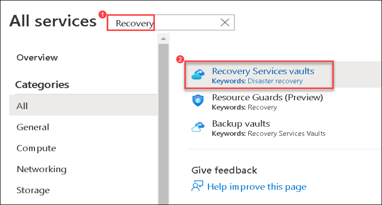
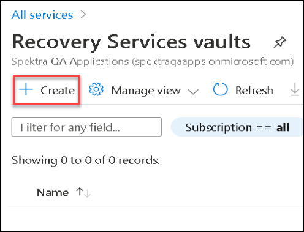
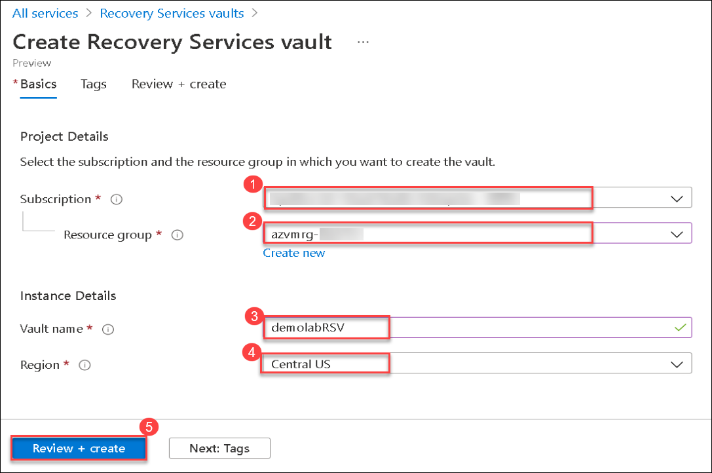
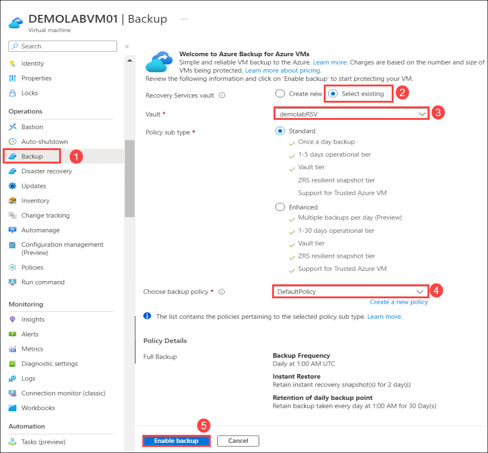

## **Scenario 4 - Backup and Recovery**
A virtual machine is protected by a locally redundant storage account, which means that it is replicated and only accessible to Microsoft in the event of a datacenter outage. In this lab, we will configure a separate backup of the VM that will be user-accessible for recovery.

This lab uses the **Azure Backup Recovery Services Vault** to back up the virtual machine with the configured policy, and will be charged as per-backup pricing. A Recovery Services vault is a logical container that stores the backup data for each protected resource, such as Azure VMs. When you enable a **Virtual Machine Backup** and the backup job for a protected resource runs, it creates a recovery point inside the Recovery Services vault. You can then use one of these recovery points to restore data to a given point in time.

 To learn more about **Azure Backup Recovery Services Vault** follow the link. [Learn more](https://docs.microsoft.com/en-us/azure/backup/backup-azure-arm-vms). 

#### **Create a Recovery Services vault**

 1. Click on the  menu icon at the upper left corner of the Azure portal.
 
 2. Then click on **All Services** 
 
 3. On the **All Services** blade, search for <copy>**Recovery (1)**</copy> and select **Recovery Services vaults (2)**

    
 
 4. On the **Recovery Services vaults** blade, click **+ Add/Create/New**

    
 
 5. In the Create Recovery Services vault blade:
 
     -Select the **Subscription (1)** you are using for the lab from dropdown menu.
 
     -Select the existing resource group named **azvmrg-<inject key="DeploymentID" /> (2)** from the dropdown menu
 
     -Provide the Vault name as <copy>**demolabRSV**</copy> (3)
 
     -**Region:** Select the region you are using to perform the lab. (4)
 
     -Click on **Review + Create (5)**
  
     

6. Then Click **Create**

7. While the RSV deploys, click **All resources** in the **Favorites** menu.

#### **Enable Virtual Machine Backup**

8. Return to the **All resources** blade and Select **DEMOLABVM01**

9. In the left pane under **Operations**, click on **Backup**(1). On the **DEMOLABVM01-Backup** blade then under the **Recovery services vault** blade:

    -on the right side **Select existing**(2) radio button 

    -select <copy>**demolabRSV**</copy>(3)

    -Choose the **DefaultPolicy**(4) from **Choose backup policy** dropdown menu.
    
  

10. Click on **Enable Backup**(5)

    > **Note:** You can check the status of the **Backup Recovery Services Vault** deployment by clicking on the notification icon. 
    
This completes this scenario. Click **Next** to go to the next scenario.
