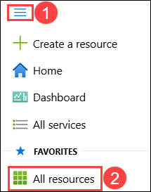
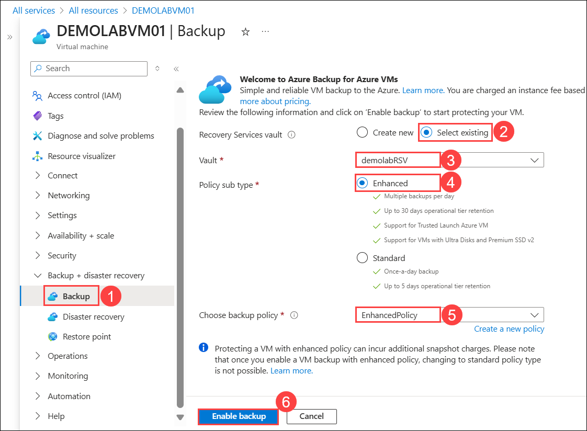
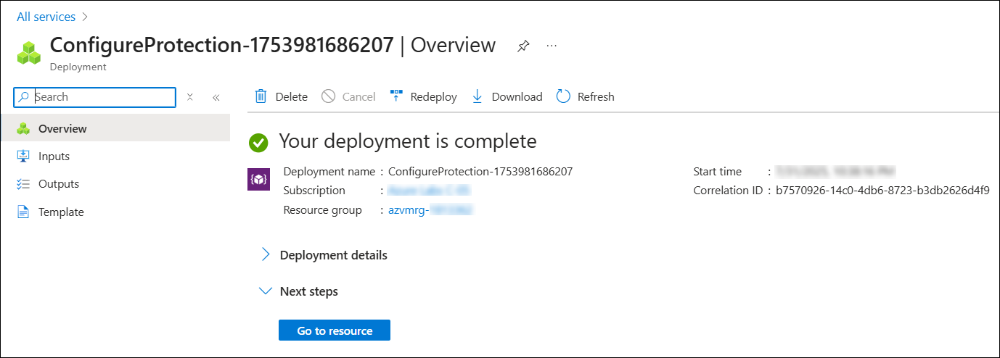

# Lab 04 - Backup and Recovery

### Estimated Duration: 30 Minutes

## Overview

A virtual machine is protected by a locally redundant storage account, which means that it is replicated and only accessible to Microsoft in the event of a datacenter outage. In this lab, we will configure a separate backup of the VM that will be user-accessible for recovery.

This lab uses the **Azure Backup Recovery Services Vault** to back up the virtual machine with the configured policy, and will be charged as per-backup pricing. A Recovery Services vault is a logical container that stores the backup data for each protected resource, such as Azure VMs. When you enable a **Virtual Machine Backup** and the backup job for a protected resource runs, it creates a recovery point inside the Recovery Services vault. You can then use one of these recovery points to restore data to a given point in time.

To learn more about **Azure Backup Recovery Services Vault**, follow the link. [Learn more](https://docs.microsoft.com/en-us/azure/backup/backup-azure-arm-vms). 

### Create a Recovery Services vault

 1. Click on the **Hamburger menu (1)** at the upper left corner of the Azure portal and click on **All services (2)**.

    
 
 4. On the **All Services** blade, search for <copy> **Recovery (1)** </copy> and select **Recovery Services vaults (2)**.

     
    
 5. On the **Recovery Services vaults** blade, click **+ Create**.

    
 
 6. On the **Basics** tab of Create Recovery Services vault blade enter the following details:
 
     - For Subscription field **Accept default subscription (1)**.
 
     - Select the existing resource group named **azvmrg-<inject key="Deployment ID" enableCopy="false"/> (2)** from the dropdown menu.
 
     - Provide the Vault name as <copy>**demolabRSV**</copy> **(3)**.
 
     - **Region:** Select **<inject key="Region" enableCopy="false"/>** **(4)**
 
     - Click on **Review + create (5)**.
  
         

7. Then click **Create**.

1. Click on the **Hamburger menu (1)** at the upper left corner of the Azure portal and click on **All resources (2)** under **Favorites**.

   

### **Enable Virtual Machine Backup**

1. On the **All resources** blade and Select **DEMOLABVM01**.

   

1. In the left pane under **Backup + disaster recovery**, click on **Backup (1)**. On the **DEMOLABVM01-Backup** blade then under the **Recovery services vault** blade:

    - On the right side, **Select existing (2)** radio button.

    - Select <copy>**demolabRSV**</copy> **(3)**.
   
    - Select **Enhanced (4)** for **Policy sub type**.

    - Choose the **EnhancedPolicy (5)** from **Choose backup policy** dropdown menu.
    
    - Click on **Enable backup (6)**.
   
      

1. Wait for the deployment to complete.

    

    > **Note:** You can also check the status of the **Backup Recovery Services Vault** deployment by clicking on the notification icon.

> **Congratulations** on completing the task! Now, it's time to validate it. Here are the steps:
> - If you receive a success message, you can proceed to the next task.
> - If not, carefully read the error message and retry the step, following the instructions in the lab guide. 
> - If you need any assistance, please contact us at cloudlabs-support@spektrasystems.com. We are available 24/7 to help you out.    

<validation step="3495a2e1-cc3c-4a87-ae1a-de01e30cba0d" />

     
## Summary

In this hands-on lab, you implemented Azure Backup and Recovery Services for VMs.

### Now, click on **Next** from the page navigation bar at the end of the lab guide page to proceed to the next page

   
