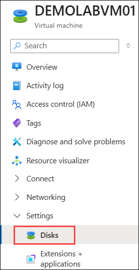
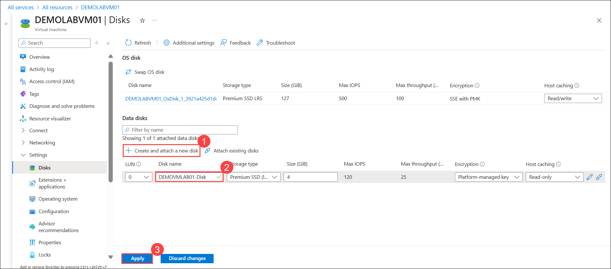
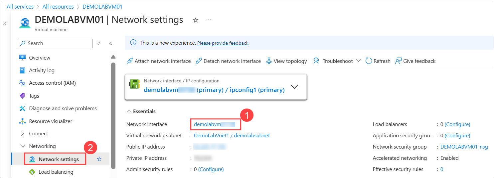

# Lab 05 - Virtual Machine Data Disk and Overview

### Estimated Duration: 30 Minutes

## Overview

In this scenario, you will attach a data disk to the VM you just created and review the information available on the virtual machine and virtual network you just created. 

### Attach a data disk

Data disks should be used in any situation where permanent data storage is needed. Data disks work with the operating system, and temporary disks created with an Azure VM provide additional disk capacity for persistent storage of data. An Azure managed data disk is a virtual hard disk (VHD). You can think of it like a physical disk in an on-premises server, except it is virtualized. Azure managed disks are stored as page blobs, which are random IO storage objects in Azure. A managed disk is an abstraction over page blobs, blob containers, and Azure storage accounts. With managed disks, all you have to do is provision the disk, and Azure takes care of the rest. 

1. Click on the **Hamburger menu (1)** at the upper left corner of the Azure portal and click on **All resources (2)** under **Favorites**.

   

1. From the All resources, select the virtual machine **DEMOLABVM01**.

    

2. In the left pane of **DEMOLABVM01** under **Settings**, click on **Disks**.

   

3. On the **DEMOLABVM01-Disks** blade under the **Data disks** section:
 
    - Select **+ Create and attach a new disk (1)**.

    - Under the **Disk name**, provide the name as <strong><copy>**DEMOVMLAB01-Disk**</copy></strong> **(2)** and leave other options as default.
    
    - Click **Apply (3)**  to add the new managed disk

      

      > **Note:** You can create managed disks from a snapshot of an existing disk, a blob in a storage account, or create a new, empty disk.

### Virtual Machine - Overview

Azure Virtual Machines (VMs) are one of several types of on-demand, scalable computing resources that Azure offers. Typically, you choose a VM when you need more control over the computing environment than the other choices offer.

1. On the **All resources** blade, click **DEMOLABVM01**

2. On the **DEMOLABVM01** blade in the right pane, go to the **Overview** section and note that you can view the following information about the VM:

   - Resource group
   - Status
   - Location
   - Subscription
   - Subscription ID
   - Computer name
   - Operating system
   - Size
   - Public IP address (if assigned)
   - Virtual network/subnet
   - DNS name (if assigned)

     
   
      > **Note:** In the Overview section, make sure that the status of the virtual machine is Running.

### Network Interface - Overview

An Azure VM must be a member of an Azure Virtual Network, which enables many types of Azure resources to securely communicate with each other, the internet, and on-premises networks. 

1. In the left pane of the **DEMOLABVM01** blade, click **Network settings (1)** under **Networking**. On the **DEMOLABVM01 | Network settings** blade, click the Network Interface name beginning with **demolabvm (2)**.

    

1. On the **Network interface** blade, go to the **Overview** section and note that you can view the following information about the network interface:

    - Resource group
    - Location
    - Subscription name
    - Subscription ID
    - Private IP address
    - Virtual network/subnet
    - Public IP address (if assigned)
    - Network security group (if assigned)
    - VM attached to

        

<validation step="9041be99-07c1-4c7d-bd75-39f3eedf30d4" />

> **Congratulations** on completing the task! Now, it's time to validate it. Here are the steps:
> - If you receive a success message, you can proceed to the next task.
> - If not, carefully read the error message and retry the step, following the instructions in the lab guide. 
> - If you need any assistance, please contact us at cloudlabs-support@spektrasystems.com. We are available 24/7 to help you out.
    
## Summary

In this hands-on lab, you attached a data disk to an Azure VM and gained knowledge on managing and optimizing VM data disks for storage performance.

Now, click on Next from the lower right corner to move on to the next page.

   
