# Lab 06: Connect to the VM and Install IIS

### Estimated Duration: 45 Minutes

## Overview

In this lab, you will configure a Windows virtual machine in Azure to function as a basic web server. You will start by updating the Network Security Group (NSG) to allow inbound HTTP traffic on port 80, then prepare Azure Cloud Shell for PowerShell access. After connecting to the VM via Remote Desktop, you will install Internet Information Services (IIS) and verify that the default IIS webpage is accessible. Finally, you will replace the default page with a custom HTML page that displays a confirmation message along with the VM’s name. This exercise demonstrates how to enable and validate web hosting on an Azure VM.

## Lab Objectives

You will be able to complete the following tasks:

- Task 1: Update Inbound security rules
- Task 2: Prepare Azure Cloud Shell
- Task 3: Connect to the VM
- Task 4: Verify Internet Information Services
- Task 5: Load a web page and monitor the VM

## Task 1: Update Inbound security rules

In this task, you will create a Inbound security rule that enables HTTP traffic (port 80) from the internet, allowing Azure Cloud Shell or any web client to connect to the VM over port 80.

 1. On the **Network settings** blade, under **Essentials**, click the **DEMOLABVM01-nsg** Network security group.
 
    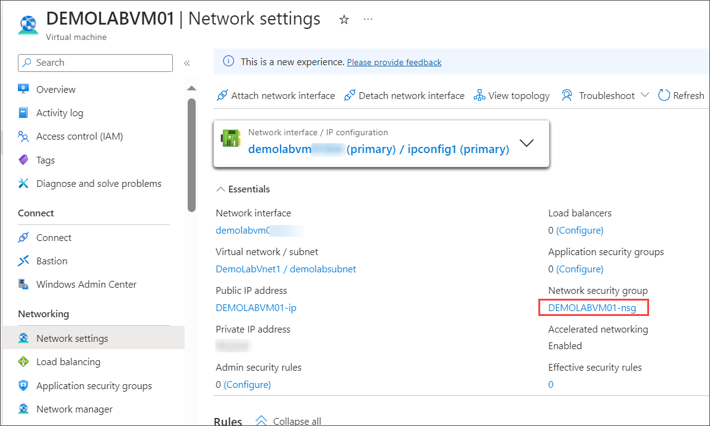
    
    >**Note:** If you are unable to see Network Security Group in Overview, click on **See more**.
 
 2. From the left navigation pane, expand **Settings (1)** and select **Inbound security rules (2)**. Click **+ Add (3)** from the top menu bar.

    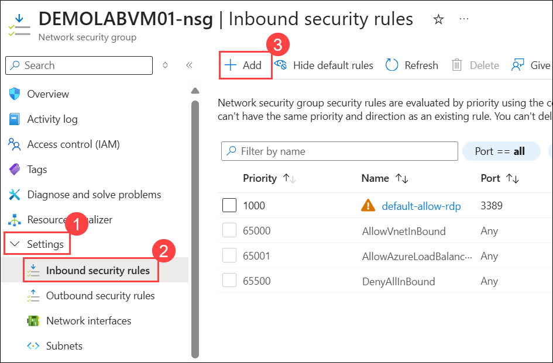
 
 3. On the **Add inbound security rule** blade, enter the required details and leave all other fields at their default values.
 
     - **Destination port ranges:** Set **80 (1)**.
 
     - **Name:** Enter **demolabrule (2)**.
 
     - Click **Add (3)**

       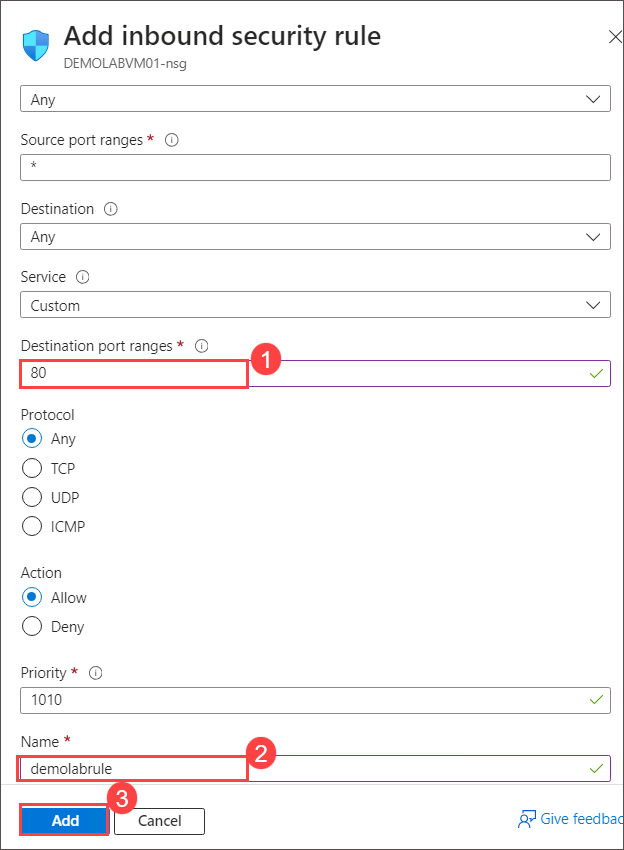

> **Congratulations** on completing the task! Now, it's time to validate it. Here are the steps:
> - Hit the Validate button for the corresponding task. If you receive a success message, you can proceed to the next task.
> - If not, carefully read the error message and retry the step, following the instructions in the lab guide. 
> - If you need any assistance, please contact us at cloudlabs-support@spektrasystems.com. We are available 24/7 to help you out.    

<validation step="ac29a4b2-b781-47ed-b706-536023ac7b14" />

## Task 2: Prepare Azure Cloud Shell

In this task, you will set up Azure Cloud Shell for the first time by creating and mounting a storage account and file share. This ensures your scripts and files are saved for future Cloud Shell sessions.

1. In the **Home** page of Azure Portal, click **Virtual machines**.
 
     

1. On the **Virtual machines** blade, click **DEMOLABVM01**.

     
 
 1. In the **DEMOLABVM01** virtual machine pane, verify that the VM status is **Running (1)**, then click the **Cloud Shell icon (2)** in the top blue ribbon.

    

    > **Note:** If you are not able to find the Cloud Shell icon, from the top navigation bar, click on the More portal tools icon  and select Cloud shell.

1. On the **Welcome to Azure Cloud Shell** blade, click on **PowerShell**.

   

1. On the **Getting Started** pane, select **Mount storage account (1)**, choose the default **Storage account subscription (2)** and click **Apply (3)**.

    

    > **Note:** Azure Cloud Shell requires a file share to be mounted to your resource group to persist files used during the session. After initial use, this fileshare will be available for future Cloud shell session.

1. On the **Mount Storage Account** pane, select **I want to create a storage account (1)** and click **Next (2)**.

     

1. On the **Create storage account** panel, follow the steps below:
   
    - **Subsciption:** Select the available **Subscription (1)**.
   
    - **Resource group:** Select the resource group **azvmrg-<inject key="Deployment ID" enableCopy="false"/>** **(2)**.

    - **Region:** Select **West US** **(3)** from the drop-down menu.

    - **Storage account name:** Enter the name **demolabstorage<inject key="Deployment ID" enableCopy="false"/>** **(4)**.
    
    - **File share:** Enter **demolab (5)**.
      
    - Click **Create (6)**. 

      

1. Wait for the storage account to finish provisioning, which may take 2–3 minutes, before proceeding to the next step.     

     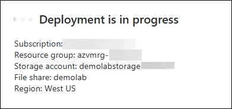

1. Run the following command in Cloudshell to check the status of the created VM.

    ```
    Get-AzVM -Name "DEMOLABVM01"
    ```

    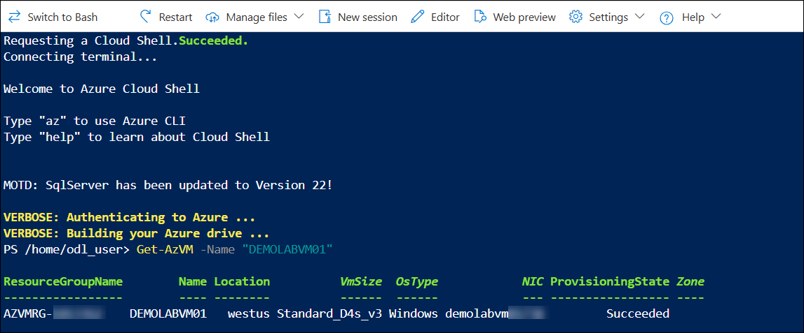    

    >**Note:** After running the command to check the status of created VM, minimize the **Azure Cloud Shell window**.

## Task 3: Connect to the VM

In this task, **within the Lab VM**, you will connect to the VM using Remote Desktop, log in with the provided credentials, and use PowerShell to install the Web-Server feature. This prepares the VM to host and serve web pages.

1. Go to **azvmrg-<inject key="Deployment ID" enableCopy="false"/>** Resource group and select **DEMOLABVM01** virtual machine.

1. From the **DEMOLABVM01** overview page, copy the **Public IP address** of the virtual machine.

    

1. To launch the **VM** using a Remote Desktop Connection, follow the instructions below.  

    - On your **Lab VM**, click the **Start button (1)**, type **remote (2)** in the search bar, and from the search results, click **Remote Desktop Connection (3)**.

      

    - In the **Remote Desktop Connection** window, paste the **Public IP address (1)** of the virtual machine copied in *Step 2*, and click **Connect (2)**.

      

    - Enter the required credentials and click **OK (3)** to log in to the Remote Desktop session.

      - Username: **demouser** **(1)**
      - Password: **Password.1!!** **(2)**

        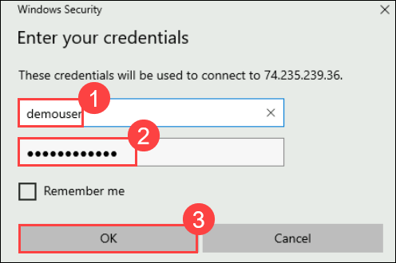    

    - Click **Yes** on pop-up.

      

1. While in the RDP session, close any pop-up windows that appear.

    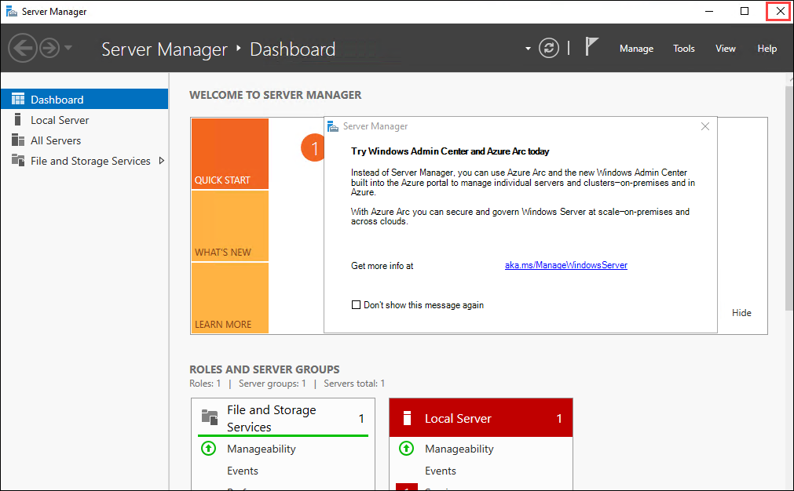

1. Click **Start (1)**, type **Windows PowerShell (2)**, right-click **Windows PowerShell (3)**, and select **Run as administrator (4)**.

    

1. Run the following commands in Powershell.

     ```
     Install-WindowsFeature -Name Web-Server
     ```

     > **Note:** You have just invoked a PowerShell command to enable the Web-Server feature on the new VM that you just created. Now you will verify the web server is active and install a simple web page.
    
     > 

## Task 4: Verify Internet Information Services

In this task, you will verify that IIS is running on the VM by opening a browser in the connected session, entering the VM’s public IP address, and confirming the IIS Welcome Screen appears.

1. On the **DEMOLABVM01** virtual machine, open **Microsoft Edge** from the desktop.

    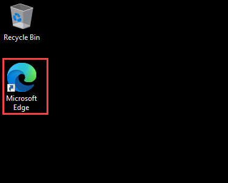

1. In the **address bar**, paste the **Public IP address (1)** of `DEMOLABVM01` that you have copied in `Task 3` and press **Enter**. The **Windows Server Internet Information Services Welcome Screen (2)** should appear.

    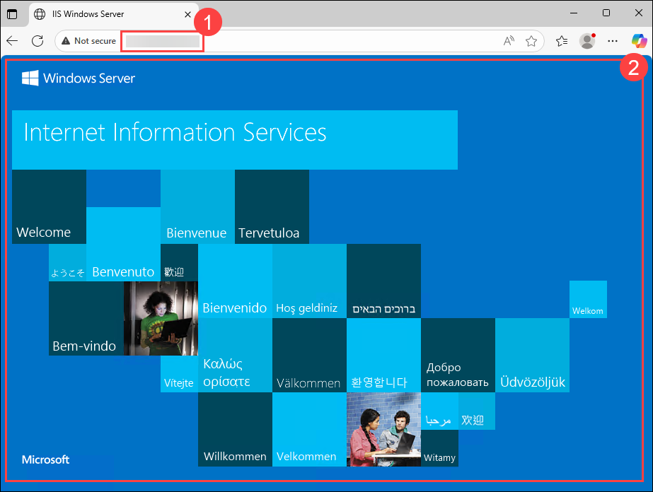

## Task 5: Load a web page and monitor the VM

In this task, you will replace the IIS default page with a custom HTML page displaying a “Congratulations” message and your VM name, then refresh the browser to confirm the change.

1. Run the following commands in Powershell.

    ```
    Set-Content -Path "C:\\inetpub\\wwwroot\\Default.htm" -Value "<html><body><h2>Congratulations!</h2><p>You have just created a basic website on $($env:computername).</p></body></html>"
    ```
   
    

1. After the script completes, return to the **IIS Welcome Screen** browser tab and click **Refresh**.

    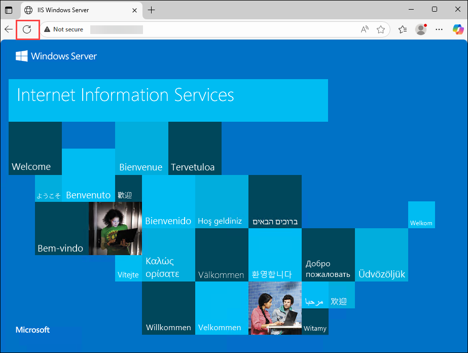

1. You should now see a **Congratulations** message that includes your VM name **DEMOLABVM01**.

    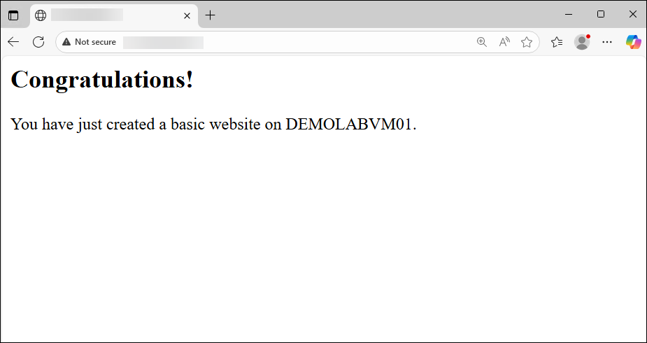

     >**Note:** In case if you are unable to see the **Congratulations** message, open a new tab and paste the **public IP address** and press **Enter**.

1. Minimize the **RDP** session, navigate back to the your **Lab VM**.    

    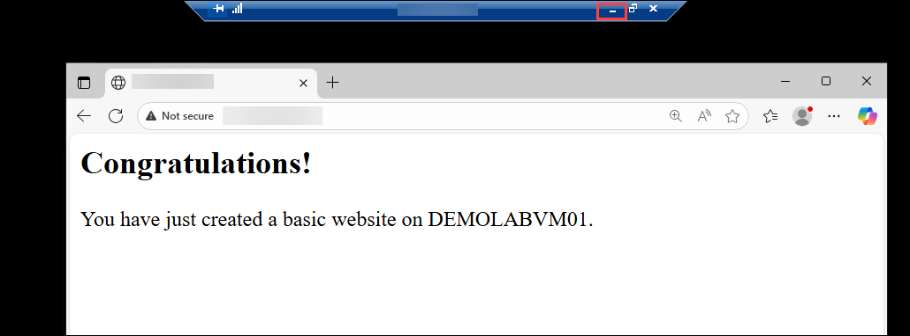

## Summary

In this lab, you have completed the following:

- Updated Inbound security rules.

- Prepared Azure Cloud Shell.

- Connected to the VM.

- Verified Internet Information Services.

- Loaded a web page and monitored the VM.

### You have successfully completed the lab. Now, click on **Next >>** from the lower right corner to proceed on to the next lab.


