# Azure Virtual Machine and Compute

### Overall Estimated Duration: 4 Hours

## Overview

Microsoft Azure is one of the leading enterprise cloud platforms. Azure launched in 2010 and has quickly matured as many new services are being added continually. One of the first and most popular services offered in Azure is **Virtual Machines**, an IaaS solution.

This lab will walk you through the steps to create and deploy a Windows Server 2019 Datacenter virtual machine. We will also configure a backup of the virtual machine that will be user-accessible for recovery. You will also be able to load a web application in the VM you have just provisioned in Azure.

## Objective

This lab is designed to equip participants with hands-on experience in creating an Azure virtual machine, compute and related resources. By completing this lab, participants will learn to:

1. **Building a Virtual Network:** Create a secure and isolated network in Azure to connect and manage cloud resources. Participants will create a secure and isolated Azure Virtual Network for resource connectivity and management.

1. **Create an Azure Availability Set:** Configure multiple virtual machines in Azure to ensure high availability and resilience against failures. Participants will configure an Availability Set to ensure high availability and fault tolerance for Azure VMs.

1. **Deploy a Virtual Machine:** Provision a virtual machine in Azure with the selected operating system and configuration settings. Participants will deploy a fully operational virtual machine in Azure, configured with appropriate settings and networking.

1. **Backup and Recovery:** Set up backup policies and procedures to protect data and applications in Azure, ensuring business continuity. Participants will establish backup and recovery procedures for Azure VMs, ensuring data protection and disaster recovery capabilities.

1. **Virtual Machine Data Disk and Overview:** Manage and utilize data disks for Azure virtual machines to enhance storage capacity and performance. Participants will manage and optimize data disks attached to Azure VMs for enhanced storage performance and flexibility.

1. **Connect to the VM and Install IIS:** Access an Azure virtual machine and install Internet Information Services (IIS) for hosting web applications. Participants will connect to an Azure VM and install Internet Information Services (IIS) for web hosting.

1. **Azure Monitor:** This hands-on lab aims to monitor and analyze the performance, health, and usage of Azure resources and applications for optimization and troubleshooting. Participants will implement Azure Monitor to track and analyze the performance and health of Azure resources and applications.

## Prerequisites 

Participants should have: Basic knowledge and understanding of the following:

- **Azure Subscription:** Access to an active Azure subscription to create and manage resources.
- **Fundamental Azure Knowledge:** Understanding of Azure basics like resource groups, Azure portal navigation, and basic networking concepts.
- **Virtualization Awareness:** Familiarity with virtual machines (VMs), including deployment, management, and basic troubleshooting.
- **Operating System Proficiency:** Competence in using Windows and Linux operating systems for VM configuration and management.
- **Networking Basics:** Knowledge of networking principles such as TCP/IP, DNS, and firewall rules, which are essential for configuring virtual networks and connectivity in Azure.

## Architecture

This Hands-on Lab cover essential aspects of Azure infrastructure and operations. Participants begin by establishing a secure Virtual Network (VNet) and configuring Azure Availability Sets for high availability of virtual machines (VMs). They then deploy VMs with specific configurations, implement backup and recovery strategies using Azure Backup Services, and manage VM data disks for optimized storage performance. Connecting to VMs, participants install Internet Information Services (IIS) for web hosting and utilize Azure Monitor for comprehensive monitoring, alerting, and performance optimization across Azure resources and applications. These labs collectively equip participants with foundational skills in Azure networking, VM deployment, data management, application hosting, and cloud monitoring.

## Architecture Diagram

## Explanation of Components

The architecture for this lab involves several key components:

- **Virtual Network:** A logically isolated network in Azure that enables Azure resources to securely communicate with each other, the internet, and on-premises networks.
- **Azure Availability Set:** Ensures high availability of applications by grouping virtual machines (VMs) within a datacenter across fault domains and update domains.
- **Virtual Machine:** Provides computing resources in Azure, allowing users to deploy and manage Windows or Linux VMs in the cloud.
- **Backup and Recovery (Recovery Services Vault):** Provides backup, disaster recovery, and data retention policies for Azure VMs and on-premises computers through centralized management.
- **Virtual Machine Data Disk:** Additional storage attached to Azure VMs for data persistence, offering flexibility in storage type (Standard HDD, Standard SSD, Premium SSD).
- **Connect to the VM and Install IIS:** Access Azure VMs via Remote Desktop Protocol (RDP) or Secure Shell (SSH) and install Internet Information Services (IIS) for hosting web applications.
- **Azure Monitor:** Comprehensive monitoring service that collects and analyzes telemetry data from Azure resources, providing insights into performance, health, and diagnostics.

## Getting Started with the Lab

Welcome to the Azure Virtual Machine and Compute Lab! In this lab, you’ll deploy and manage VMs, configure compute resources, and optimize performance for workloads. Let’s get hands-on with Azure compute services!
 
## Accessing Your Lab Environment
 
Once you're ready to dive in, your virtual machine and **Guide** will be right at your fingertips within your web browser.

   

## Lab Guide Zoom In/Zoom Out

To adjust the zoom level for the environment page, click the **A↕** icon located next to the timer in the lab environment.

   

## Virtual Machine & Lab Guide
 
In the integrated environment, the lab VM serves as the designated workspace, while the lab guide is accessible on the right side of the screen.

>**Note:** Kindly ensure that you are following the instructions carefully to ensure the lab runs smoothly and provides an optimal user experience.

## Exploring Your Lab Resources
 
To get a better understanding of your lab resources and credentials, navigate to the **Environment** tab.
 
   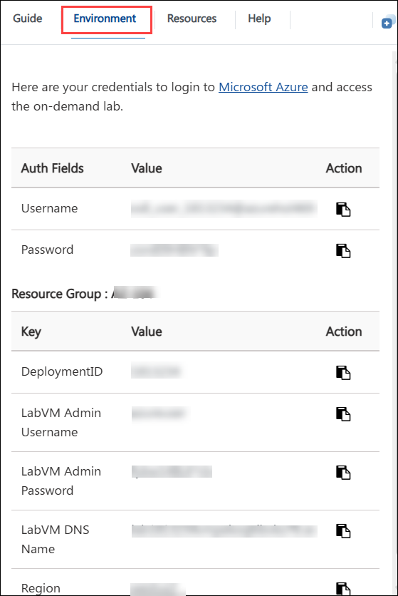

## Utilizing the Split Window Feature
 
For convenience, you can open the lab guide in a separate window by selecting the **Split Window** button from the Top right corner.
 
 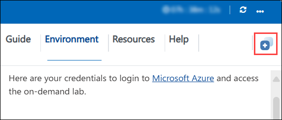
 
## Managing Your Virtual Machine
 
Feel free to **start, restart, or stop (2)** your virtual machine as needed from the **Resources (1)** tab. Your experience is in your hands!
 
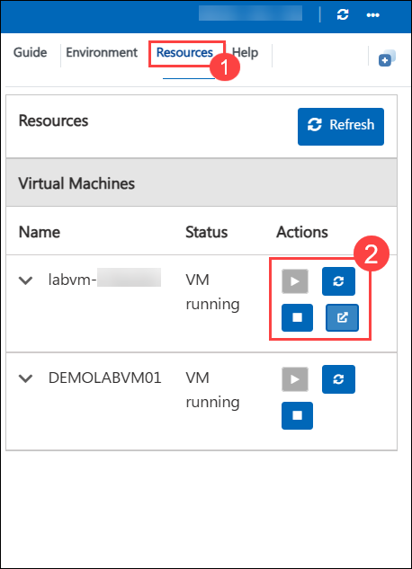

## Lab Validation

1. After completing the task, hit the **Validate** button under Validation tab integrated within your lab guide. If you receive a success message, you can proceed to the next task, if not, carefully read the error message and retry the step, following the instructions in the guide.

   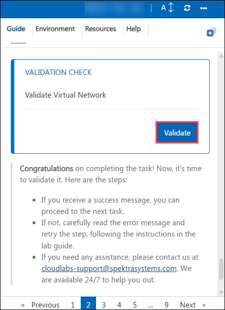

1. If you need any assistance, please contact us at cloudlabs-support@spektrasystems.com

## Let's Get Started with Azure Portal

1. On your virtual machine, click on the **Azure Portal** icon as shown below:

   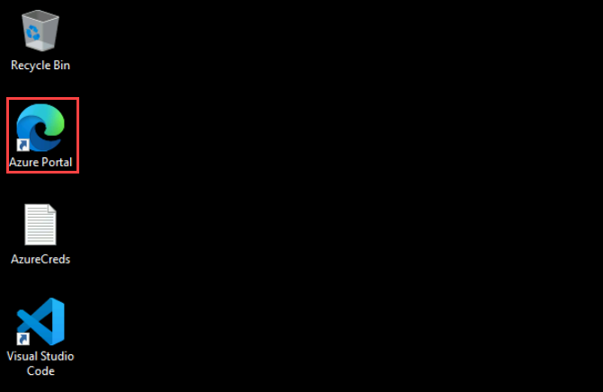
   
1. You'll see the **Sign into Microsoft Azure** tab. Here, enter your credentials:
 
   - **Email/Username:** **<inject key="AzureAdUserEmail" />** and click on **Next**.
 
       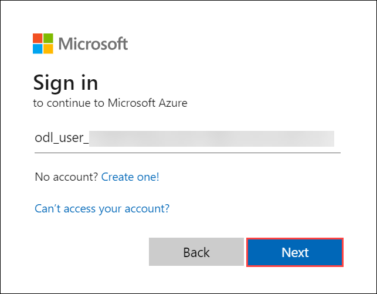
 
1. Next, provide your password:
 
   - **Password:** **<inject key="AzureAdUserPassword" />** and click on **Sign in**
 
       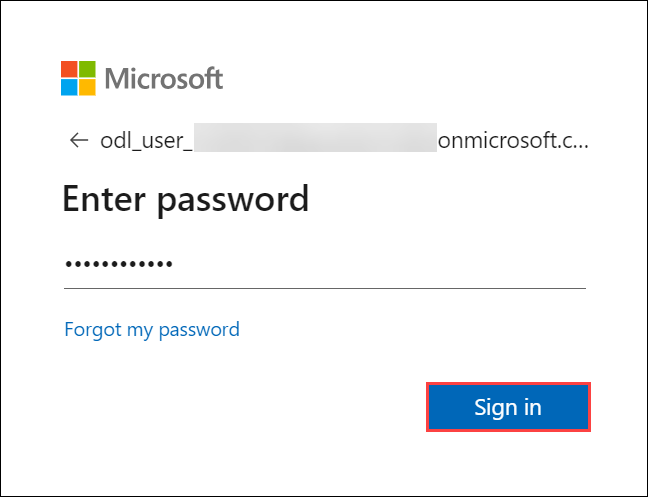

1. If **Action required** pop-up window appears, click on **Ask later**.

   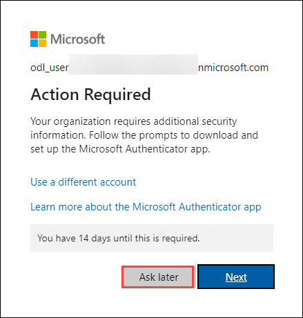
    
1. If prompted to stay signed in, you can click **No**.

   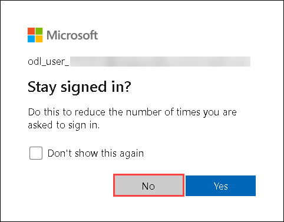

 
### Steps to Proceed with MFA Setup if the "Ask Later" Option is Not Visible

1. If **Action required** pop-up window appears, click on **Next**.
   
   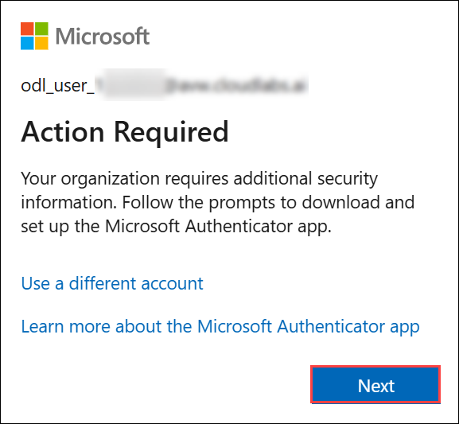

1. On **Start by getting the app** page, click on **Next**.

   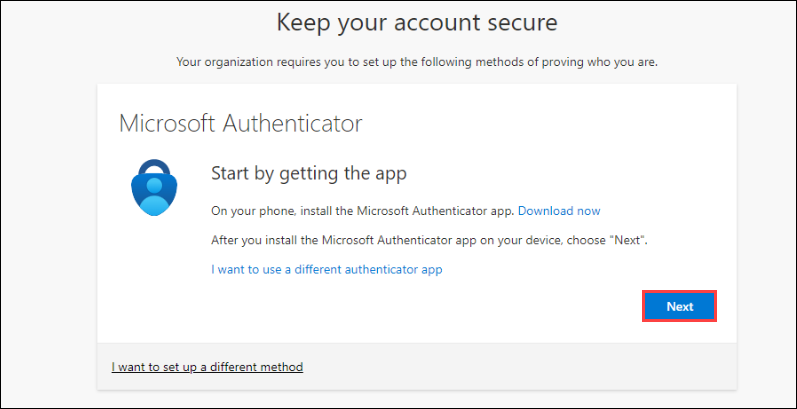

1. Click on **Next** again.

   

1. In **android**, go to the play store and Search for **Microsoft Authenticator** and Tap on **Install**.

   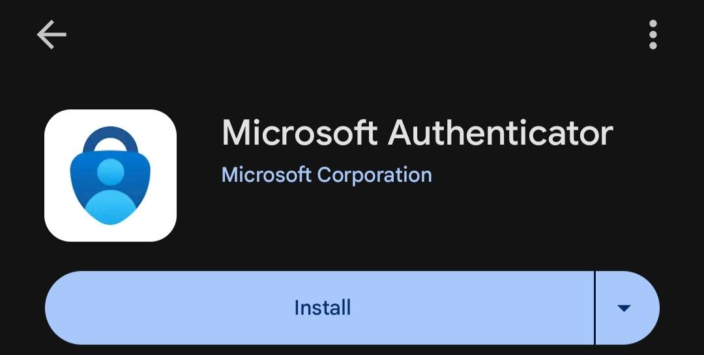

   > Note: For iOS, open the App Store and repeat the steps.

   > Note: Skip if already installed.

1. Open the app and tap on **Scan a QR code**.

1. Scan the QR code visible on the screen **(1)** and click on **Next (2)**.

   

1. Enter the digit displayed on the Screen in the Authenticator app on your mobile and tap on **Yes**.

1. Once the notification is approved, click on **Next**.

   

1. Click on **Done**.

1. If prompted to stay signed in, you can click **"No"**.

1. Tap on **Finish** in the Mobile Device.

   > NOTE: While logging in again, enter the digits displayed on the screen in the **Authenticator app** and click on Yes.

1. If a **Welcome to Microsoft Azure** pop-up window appears, simply click **"Cancel"** to skip the tour.

1. If you see the pop-up **You have free Azure Advisor recommendations!**, close the window to continue the lab.   

## Support Contact
 
The CloudLabs support team is available 24/7, 365 days a year, via email and live chat to ensure seamless assistance at any time. We offer dedicated support channels tailored specifically for both learners and instructors, ensuring that all your needs are promptly and efficiently addressed.

Learner Support Contacts:
- Email Support: cloudlabs-support@spektrasystems.com
- Live Chat Support: https://cloudlabs.ai/labs-support

Now, click on Next from the lower right corner to move on to the next page.

   

### Happy Learning!!
