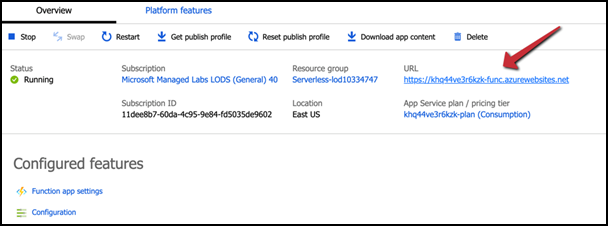

## Adding authentication to the function app

An important aspect for many application is authentication and security. While we have published this app to the cloud, we still want to secure it behind a login screen so that each user only sees their own todo list items. Azure Functions has a feature called "Authentication" that enables you to handle and enforce authentication outside of your function code. Let's finish configuring those settings now.

1.	Open a web browser (on your virtual machine or on your host machine)
2.	Navigate to the Azure Portal: https://portal.azure.com
3. 	Login with your Azure username and password:
      - **Username : <inject key="AzureAdUserEmail" /> **
      - **Password : <inject key="AzureAdUserPassword" /> **
4.	Select to view **Function Apps**
5.	Open the function app that you deployed to earlier
6.	After it finishes loading, select the **Authentication** option

>o	Notice how authentication was enabled during deployment, but hasn't yet been configured. 
There are many identity providers we could leverage. 
For this app, let's require an Azure Active Directory logon (either a corporate or Microsoft account).

7.	Click the **Not Configured** option under **Azure Active Directory**

    
    
8.	Choose **Express** to easily create an AAD app
9.	Click **Ok** and then **Save** to save and generate an app to login to for access to your functions
10.	Close the Authentication configuration screen
11.	Click the **URL** link to attempt to access your function app information 

     
    
 >Copy and paste the Function URL somewhere handy like Notepad in the virtual machine. You will need to know the part of the function before .azurewebsites.net for later in the lab and use it lots.
 
 >(If you get any errors you may need to wait 30 seconds for the AAD application you created to fully register). If everything worked right it should require you log in with your Azure account before loading and rendering a "Your function is running screen."
 
 >Now your function app is protected behind authentication, and our app can use that authentication to surface user-specific data
 
 
 
 
 
 
